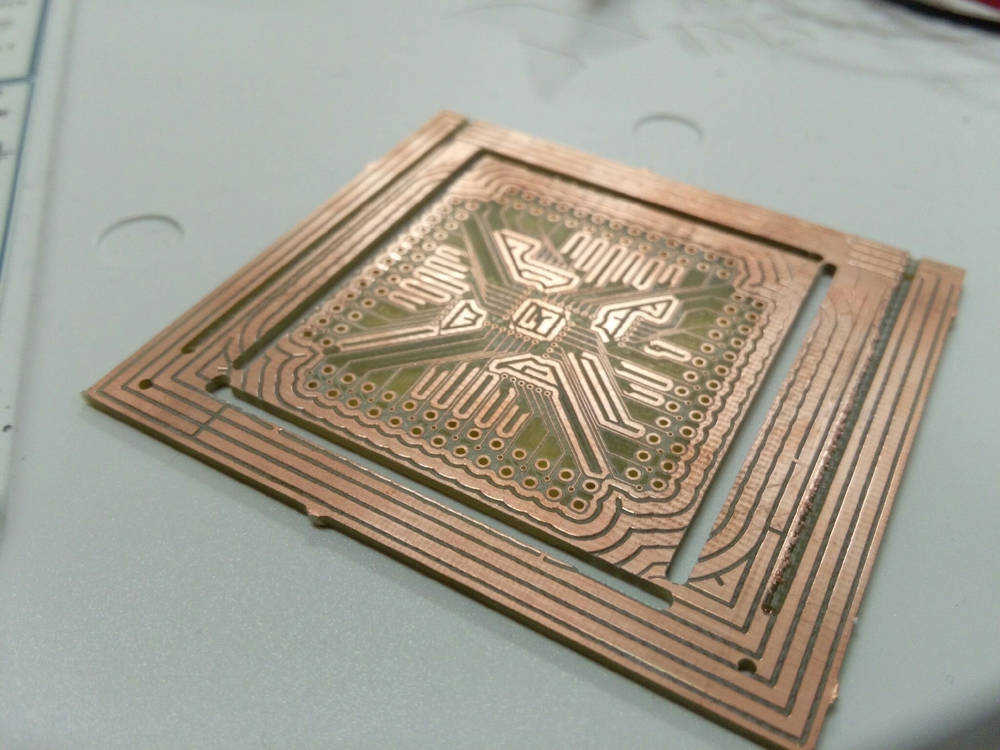
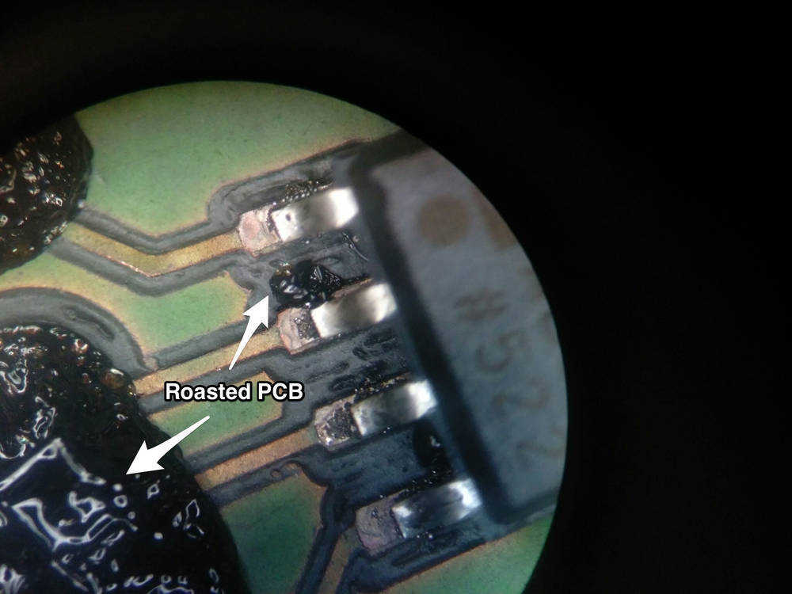
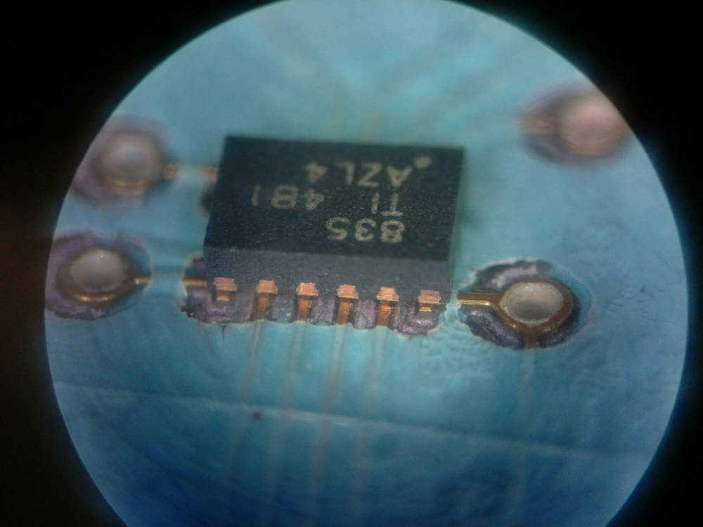

# 01_Personality Test Results
#SeniorDesign

# 02_First Independent Group Meeting (event date: 30/8/15)
#SeniorDesign
My group had its first official meeting outside of class on Sunday evening at 6:30 on August 30. We each brainstormed potential project ideas as well as offered ideas we had thought of over the summer.

_Patrick Miller proposed a needle_medical utensile sterilizer device (autoclave) that could operate independently of electrical supply or fuel. It was proposed that it would boil water by using a combination of solar heat and human heat generation via an electromechanical motion-to-electricity-to-heat hand crank/
 
 
_Devin Benson proposed a diabetes insulin injection assisting device that would aid patients in determining how much insulin was needed for their dose and perhaps as well aid in administering the insulin into a patient’s system. He also came up with an idea of a sit-to-stand assistive device that would relieve patients of the effort or complication of rising from a sitting position._
 
 
_Christopher Palmore proposed a project to improve the prosthetic-hand device that the Harding BME’s had previously designed._
 
 
_I proposed a remote controlled cart that could be used to assist handicapped or frail people in transporting objects around their house. The cart could potentially carry 100-150 lb and could supposedly reduce a person’s need for human help in daily chores_actiities./

After we each discussed our tentative thoughts that were produced over the summer we brainstormed other potential project topics including ideas that were proposed by fellow Harding professors Dr. Lance Gibson and Taylor Williams.

Dr. Gibson had told the group that an improved weight-reducing recovery treadmill would be a good idea. He mentioned that the one he used during his health recovery lacked in comfort during usage.

While going over some of these ideas, we came across a product we found on the internet known as “muscle fiber”. Muscle fiber has the ability to contract when current or heat is applied to it. This sparked out interest in project ideas such as the sit-to-stand device where a contracting cord could potentially be used. For the rest of the meeting (ended around 9:30 pm) we talked about basic mechanics of the human body in sit-to-stand motion and how contracting muscle fiber or similar devices could be used in such a product.

# 03_PT Tour (event date: 1/9/15)
#SeniorDesign
Context: My group (and other BME) was given a tour_review of Harding PT school's equipment, facilities, and recovery devices. Physical therapist Anita Killens showed us around the facilities and gave useful insight on patient_trainer experiences with the current devices and equipment as well as aspects of the current technology that could be improved.

**Helpful Ideas Anita and groups brainstormed:**
Hand plant/weight shift device
Finger tensioner/extender; forearm equivalent
Shoulder assist
Scoliosis back support/breathing ability
Leg splint with on/off capability
Sit-to-stand back corrector: not leaning forward far enough: "nose-to-toes"

With tensioner devices, Anita expressed the importance of having a balance of patient independence and device assistance. Too much device assistance results in muscle/limb degradation.

# 04_Class Notes: Tues. (event date: 1/9/15)
#SeniorDesign
**Due Thursday:**
- [ ] 1st ENGR Notebook
- [ ] Quiz 3 Chapter 5

**Topic Selection:**
- [ ] **Project Topic**: short phrase that describes your planned prototype
- [ ] **Problems**: your product will solve
- [ ] **Project Description**: full paragraph(s) depicting overall function(s) of device and technological scope
- [ ] **Benefits**: benefits for intended users
- [ ] **Decision Matrix**: 3 or more project finalists with decision summary
- [ ] **Team Members and designated leader**: submit one MS Word document to Canvas

**Senior Design Rule #2:** have a passion for your design project

**Decision Matrix:**

**(1)** Determine the selection criteria
**(2)** Determine criteria weights
(a) percentage = relative importance
(b) ensure total of all weights
**(3)** Identify reasonable alternatives
**(4)** Rate alternatives relative to the criteria
(a) recommend 1,5,9 (good,better,best)
(b) never use more than 5 levels
**(5)** Compute scores for alternatives
**(6)** Evaluate and review decision
(a) usually reject several alternatives
(b) if 2+ alternatives look feasible
(i) review eights and re-score
(ii) multiply scores rather than add
(iii) determine additional realistic criteria to help discriminate

**Recommended Criteria:**

class requirements

**Group Thoughts:**
After discussing Physical Therapy tour, the finger tensioner forearm-device seemed to be preferred project trajectory.

_Hand plant_weight shift device/

_Finger tensioner_extender; forearm equivalent:/
 discussed more extensively, included as a possible project topic due to feasibility and inclusion of electrical and mechanical components

_Shoulder assist:_
discarded as project topic due to the problem of overcomplicating the device with electronics when mechanical systems may be better for this application

_Scoliosis back support_breathing ability:/
 
 
_Leg splint with on_off capability:/
 
 
_Sit-to-stand back corrector: not leaning forward far enough: "nose-to-toes":_
discarded due to complicated nature of gait and human locomotion (lots of research would need to be done studying how device would affect other aspects of sit-to-stand locomotion other than simply the "nose-to-toes" movement

_Weight assisted treadmill:_
added as project topic possibility because of good BME/EE field inclusion and feasibility

_Sterilization solar-clave:_
added as potential project topic for feasibility & BME/EE inclusion but not as preferred due to smaller innovation aspect

_Prosthetic arm:_ hand replacement, attaches to forearm

added as potential project topic

To finish up our in-class meeting we decided on the criteria points for our project topic selection matrix.

# 05_Second Independent Group Meeting (event date: 2/9/15  5:00pm)
#SeniorDesign
Our Sr. Design group first reviewed each individual’s completion of the design matrix for the four potential project topics that were decided upon in the previous in-class meeting. Based on the criteria points of:
_(1) ease and necessity of adding an EE component_
_(2) importance of safety_
_(3) user interaction_
_(4) complexity_
_(5) innovative_
_(6) outside help needed_
_(7) budget friendliness_
_(8) fun factor_
_(9) accessibility of outside guidance_
_(10) need_
the group’s completion of the weighted decision matrix (Fig. A) indicated that the hand tensioner device (proposed by Anita Killens on PT tour) and the prosthetic hand improvement were the best project topics out of the four (hand-tensioner, recovery treadmill, prosthetic hand, autoclave needle sterilizer). Of the two, the hand-tensioner device came out with an average score higher than the prosthetic hand, and the group tentatively agreed that this was a project we wanted to attempt for our Sr. Design course.

Figure A: Austin R English’s Decision Matrix Results

After deciding on our project idea, we wanted to choose our team leader. First we asked who was interested in the responsibility of team leader. Devin Benson and Chris Palmore offered their commitment to the position of team leader. After raising several criteria points for a potential leader, the decision mainly came down to who would potentially be the least burdened by the responsibility (who had the least credit hours_job hours_etc). We figured that someone with fewer outside responsibilities could be a good leader. It turned out that Devin had a heavy course load this semester and next semester, while Chris had fewer hours this semester and would have even fewer next semester. Both members have had great leadership experience in various student organizations, but the whole group agreed that leadership responsibility may be less of a strain on Chris than on Devin, so we chose Chris as our team leader.

We ended our meeting with Devin agreeing to handle submitting our decisions to the professors through Canvas/etc.

# 06_Class Notes: Thurs. (event date 3/9/15)
#SeniorDesign
Rule #2: Have passion for your work/design project.

_**Engineering vs. Science**_
- [ ] engineers look for new information for application / scientists look for new information
- [ ] science is a quest for knowledge for the sake of knowledge / engineering is an application of science and knowledge to solve problems

_Engineering Method:_ strategy for causing the best change in a poorly understood situation within the available resources

**Analysis**: the process of breaking a complex topic or substance into smaller parts to gain a better understanding of it
**Synthesis**: the process which combines two or more pre-existing elements and results into something new

**Rule #3:** empathize with the customer (user); the customer(user) isn’t always right, but the customer is the customer
- [ ] observe people using similar products/tasks
- [ ] interview potential users
- [ ] create personas which describe the customer and your product will be used
- [ ] role play
- [ ] review prototypes with the users

**Rule #4:** expect the best, plan for the worst

_**A3 Reports:**_
- [ ] informal oral status reports
- [ ] two week cadence (mostly)
- [ ] one page/slide documentation
- [ ] group based (most of the time)
- [ ] all groups observe

_effective habits of problem solvers_
- [ ] recognize and define important problems
- [ ] solve them
- [ ] learn from the problem solving
- [ ] share the learning with others
**resume skills entry: “_A3 Problem Solving_ ”**
 
 
**Improvement Cycle (PDCA)**
 P = Plan the Improvement or change
D = Do (make the change happen)
C = Check the results (what was learned, what went wrong)
A = Act (adopt change, abandon, or recycle)

**Elements of A3 Thinking**
Objectivity
Standard Story
Results and Process
Synthesis, Distillation, And Visualization
Alignment: places high value on agreement about decisions; “3D” communication, up/down the hierarchy, horizontal comm.,
Coherency, Consistency: coherence from one step to the next
Systems Viewpoint

_Why one page reports?_
- [ ] forces deeper understanding to express concisely
- [ ] greater efficiency
- [ ] better distribution and likelihood of reading
- [ ] facilitates dialog

# 07_Third Independent Meeting (event date: 6/9/15)
#SeniorDesign
_**Part 1**_
Our BME group (Devin, Patrick, Chris, and I) meet at 8:00pm to address some of the feedback Dr. Wells gave us about our project topic. Devin mentioned our project idea to Dr. Wells, and Dr. Wells suggested that we verify the usefulness of a **hypertonia combatting device** to the stroke victim population.

Upon reading through medical research on the topic of stroke recovery and hypertonia issues, we found that of the 15 million stroke victims/year, 10 million survive and of those ~77-81% experience decreased extremity motor control leading to 66% of those having immobilized extremities after 6 months post-stroke. This immobilization is caused by complete loss of motor control resulting in muscle tightening and contraction. However, many victims who retain motor control during the first 6 months still lose extremity control due to the inability to overcome the partial resistance caused by temporary muscle contraction. With assistance, patients can overcome this temporary resistance and regain muscle flexibility along with extremity control. These patients are among the approx. 5 million who experience immobilized extremities after six months of undergoing a stroke.

We concluded that this was a significant problem among stroke victims and that reducing the hypertonia in stroke victim extremities could reduce the percentage of initial-paralysis stroke victims who end up never recovering control over their affected extremities.

_**Part 2**_
We also wanted to verify the uniqueness of our proposed device by (a) looking for similar devices, (b) comparing the price of known devices, and (c) identifying improvements/dissimilarities between those and our idea.

We found a range of hand-hypertonia combatting devices ranging from cheap passive devices at $10 to expensive active machines at several thousand dollars. The cheapest active device we identified was ~$1000; we set our proposed active-device to cost less than $1000.

_**Part 3**_
Finally we refined our project proposal paper to accurately reflect our project’s aim while not restricting us to overly-particular methods of accomplishing our goal.

# 09_SolidWorks Tutorial (event date: 8/9/2015)
#SeniorDesign
On Tuesday evening at 7:00pm, Dr. Wells hosted a SolidWorks training tutorial for SolidWorks. Taylor Williams recommended the session to us, considering that none of us had had rigorous SolidWorks training as the ME’s do. We agreed that SolidWorks would be very useful in designing our product, especially considering that any physical simulations we perform may not mimic the human hand as accurately as we may be able to in SolidWorks.

On Tuesday night, Patrick, Devin, and I went to Dr. Well’s SolidWorks session and successfully designed a disk brake, learning some of the basics of SolidWorks part design. We plan on attending the Thursday night session as well with Chris to get some more experience.

# 10_Device Concepts (event date: 9/9/15)
#SeniorDesign
Each member of the group has been drawing concept sketches of our device to help visualize what it might look like. This has helped us to see some of the initial design constraints and problems we might run into. Tomorrow morning though, we are going to meet again with Anita at the PT school to discuss other aspects_problems that we’ll need to overcome from the PT trainer_patient perspective.

Figure A shows a possible hand attachment, which if the wires are able to contract/loosen, could perhaps relieve hypertonia related to a stroke victims hand. Similar to the David sculpture (by Michelangelo), many stroke patients’ hands contract inwards with there fingers clenching as well. Routing rings serve to guid the contracting wires across the hand’s contours keeping wire from rubbing a patient’s hand.

Figure A: Concept Design of "Hypertonia-Combatting Device" Hand Attachments (Background Sculpture is David by Michelangelo)

We’re unsure if the hand device and arm device should be part of one system, so in this image, I just drew a potential hand device battery&power circuit housing (the arm device would likely have its circuit and battery housing near the shoulder or maybe in a backpack).

Figure B: Concept of “Hypertonia Combatting Device” Complete Hand Rig (Background Sculpture is David by Michelangelo)

# 11_Meeting With Anita Killings (event date: 10/9/2015)
#SeniorDesign
Our group met again with Anita at the PT school to talk about preliminary patient needs for relieving the spasticity/hypertonia in the hand.

“How much assistance should a device give to the patient in opening their hand?"
- [ ] _Anita emphasized that slow, steady force was necessary to open the hand or other extremities suffering from spasticity. Forcing an extremity open too fast may break a bone especially if force is applied very far past the natural muscle fulcrum. Once a hand is opened, very little to almost no force is needed to maintain open position. Also in patients with more muscle tone problems, the fingers are more likely to curl in more tightly._
 
 
“What is the process of opening a spastic hand?”
- [ ] _Anita said that the procedure for opening a patient’s hand so that they could use it began with straightening their wrist so that the hand is parallel with the forearm. Then pressing on the two lower palm muscle pads is done to coax the hand open out of a clenched position. As this is done, the fingers are gently persuaded out to an open position._
 
 
“How long does it take for a patient’s hand to return to a clenched position after opening?"
- [ ] _Anita mentioned that muscle tone reclaims a patient’s hand soon after they stop using it. In other word’s a patient’s hand will return to a clenched position the same as an unaffected person’s hand would return to a resting position after using it (a few seconds). Keeping the hand open though is somewhat effortless, once the hand has been opened._
 
 
- [ ] _Anita warned about applying force to far out past a muscle’s natural fulcrum point. Over a person’s lifetime, bone’s natural fulcrum point build’s up strength in that spot. If for example a pushing force were applied near the wrist in order to extend the arm, the forearm bones could potentially break since the fulcrum (which is structured to more evenly distribute the force) is closer to the elbow._
 
 
_-_ _Anita also recommended doing research on a product called “DynaSplint” which is a sort of dynamic splint that instead of rigidly conforming a spastic arm applies great force to the arm through a sort of spring(rubber cords) cast system. She mentioned that this would be a helpful resource for obtaining data needed for designing our device, concerning needed forces and force points._
 
 
“If we were designing both a hand-spasticity and arm-spasticity device, would it be important which order the hand and arm were assisted in opening?"
_- Anita said that the order of opening the hand and arm would only depend on what activity the patient was undertaking. For example drinking with the arm closed vs. grabbing a ball with the arm extended._
 
 
_- She also talked a little about statistics of stroke patient recovery, remarking that patients who are able to have their hands_arms assisted in the opening process are able to exercise them more and eventually regain use of their arms. Without aid, stroke patients can completely lose functionality in their arms after a period of time due to extreme muscle toning./
 
 
_-Finally Anita gave us an information sheet regarding grasping positions for the hand (she also gave us a textbook containing hand-anatomy material) and offered to ask one of her patients if he would want to work with us to demonstrate some of the difficulties of dealing with spasticity in his hand._

# 12_Class Notes Thurs. (event date: 10 SEP 2015)
#SeniorDesign
_**Due Tuesday**_
- [ ] Quiz 6

_**Group 2 A3**_
followup questions:
“What is the motivation for this project?"
“What kind of goods, robot, and situation; what is the scope?” (be specific)
“What are the main characteristics of your device?"

_**Group 6 A3:**_
follow-up questions/comments:
_be specific on descriptions_
_a stat or fact to show why this is needed would be helpful_
 
 
 
 
_**Rule #6:**_ Stress levels in April are inversely proportional to the magnitude of accomplishments in the Fall

_**Team Time:**_
We’ve discussed the Governor’s cup competition. Several business teams have offered to work with us, but we are trying to work out team composition (4 business, 2 engineers or 3 business, 3 engineers)
We also discussed out A3 report due next week Thursday and we each chose sections of the report to present. We outlined points to make in each A3 section and contemplated several physics topics including force and acceleration.

# 13_Governor’s Cup Business Team Alliance Meeting (event date: 10 SEP 15)
#SeniorDesign
Our team met at 10:00pm together to discuss our options concerning the Governor’s Cup competition. Earlier in the day, Chris had interviewed two interested business teams. We discussed the qualities of teams including the individual team members. We decided to choose the team led by Sarah Hughes and Jeremy as several of our group members knew them personally and the team had a solid proposal of team composition on their end which would include an accountant.

# 14_Class Notes (event date: 15 SEP 15)
#SeniorDesign
__Thursday__
A3 Report

_Next Tuesday_
Project Launch Rough Draft

_Team Time:_
Our group reviewed the components of our A3 report which each team member had composed and refined the report slide.
Additionally, we conducted a preliminary finger-tension test using some string, a pulley, and weights. To perform the test, a string was attached on one end to a weight hanger in free air and the other end to a participant’s finger. The participant laid their hand out palm-up on the table-top, and the weight was hung off the side of the table, being routed through a pully at the edge of the desk. Each finger, excluding the thumb, was tested by adding weight to the hanger until the finger extended to a position that we considered to be the minimum position needed for an extended finger (Figure A). All of the tests are summarized in Figure A with Fingers 1-4 being the index finger through the “pinky” respectively.

**Figure A: Results of preliminary tests to determine the minimum force needed to extend a finger**

# 15_Project Launch Meeting (event date: 20 SEP 15)
#SeniorDesign
Our team met to combine our individual sections of the Project Launch Report into one document. Each team member has composed the following parts:

Chris: Title Page, Overview, Statement of Problem
Devin: Customer Needs, Technical Requirements Specifications
Patrick: Plans to Proceed, Attachments
Austin: Preliminary System Test Plan, Operational Description, Implementation Considerations

We revised the document, with Chris and Patrick doing the editing, and planned for our meeting with Anita, Rusty(Occupational Therapist), and Steve(Stroke patient) the next day at 5:15pm.

# 16_Meeting With Anita Killins / Rusty (OT) / and Steve (patient)  (event date: 21 SEP 15)
#SeniorDesign
Anita was able to schedule a meeting with occupational therapist Rusty and stroke patient Steve for our group. We wanted to meet with an OT in order to understand the everyday complications of working with stroke patients and other rehabilitated people who needed some form of assistance in recovering arm and hand function. Steve is a stroke victim who has mostly recovered from his stroke (did not happen too recently), but still has problems with muscle tension in his left hand and arm. We wanted to meet with a stroke patient to better understand how high muscle tone interrupted normal hand usage and to ask about other basic patient needs.

**Rusty**: Rusty provided a very helpful perspective to the meeting with realistic considerations and experiences. He mentioned that a device which could successfully assist a patient in opening their hand and using it could be overshadowed by the patient’s lack of arm use. For example, a patient may be able to use the device to help them hold a drink in their hand, but with their arm hanging limp (or contracted) the hand assistance will not be useful considering that the hand is going to be swinging around with the uncontrollable arm.

It was mentioned that during his early recovery period, Steve had fair control over his arm. Instead his hand was the problem, as he would have to continuously work to forcibly keep it open whenever needing to use it for weight bearing or carrying objects. In this case, a hand-assistive device would be beneficial.

Rusty also said that a device that required too much interaction of the patient’s good arm in order to operate practically wouldn’t be used. Stroke patients rely heavily on their unaffected side to perform tasks that they can no longer use both hands or arms for. Occupying the good arm/hand too continuously would be detrimental to the purpose of the device.

**Steve:** Steve discussed some of the difficulties involved with regaining muscle control after his stroke. He mentioned that immediately after his stroke, he had lost control his left arm and hand. He quickly began to recover muscle control, but by the time this control began to return, his muscles had already began developing muscle tone. 

He said that his arm was not as difficult to use normally, but his hand, as with many stroke patients, would curl into a fist whenever he was not using it. This would require him to tediously open his hand, one finger at a time, normally pressing his opening hand against a table top to keep it open during the process. After this he could use his hand for a particular function such as carrying a box, or bearing his weight (maybe for standing-to-sitting motion). However, keeping his hand open in a desired position required most of his focus during the task. As soon as he would divert focus to some other aspect of the task, his hand would lose control and go limp. This was a very big hassle particularly for jobs such as carrying groceries or buckets.

He mentioned that at times he wished he could simply have his hand open to just one position (similar to splinting) to prevent from having to constantly manually open it. This would also eliminate the problem of losing control in his hand as soon as his focus was diverted.

**Anita:** Anita talked about the importance of the patient being able to remove a device quickly if they began to experience pain or uncomforted from its assistance. This prompted Rusty’s next part of the discussion.

**Rusty:** Rusty warned that a complex device using motors, cables, and active forces would very likely deter patients from using it. He talked about how patients might be uneasy about a device that pulled back on their fingers, uncertain of when it would stop applying force. Of course, we have considered this as part of the safety of our design (that it does not have the ability to force a patient’s fingers or hand out of their range of motion). But he offered a device concept that would allow patients to manually mold their hand to the shape that they wanted to use it in. The device would not be actively pulling or pushing on their fingers, just resisting the muscle tone and preventing unwanted limp hand problems.

He compared it to a ratcheting system that can be clicked into certain positions and locked along the way if desired.

**Anita:** In discussing how to differentiate between unwanted muscle contracture and normal muscle movements, Anita said that unwanted muscle contracture will normally happen simultaneously in the wrist and fingers, while normal independent muscle movements are not as often both contractions at the same time.

**Steve:** Steve offered to demonstrate how muscle tone in his left hand still affected him. Patrick held his arm out horizontally for Steve to grasp. As Steve closed his hand around Patrick’s arm, his hand appeared to function almost normally until muscle tone began to tighten the grasp on Patrick’s arm. It seemed like muscle tone was causing any grasping functions to be over-exaggerated and therefore difficult to perform precisely. When Steve tried to pick up a pen, he was successful, but it took a great deal of focus to keep his fingers under control as he grasped the pen with his fingertips.

The discussion mainly ended with Rusty emphasizing the benefit of simplicity in the device. He also mentioned the thermoplastic materials that he and his colleagues use to make temporary splints for patients. The plastics can be heated and molded to a patient’s arm form, but the material is expensive.

# 17_Team Time, Tuesday (event date: 22 SEP 15)
#SeniorDesign
During team time we worked on revising our Project Launch Rough Draft, taking into consideration what we learned from Steve and Rusty (passive simple device much better than complicated active).

We spent a lot of our time trying to come up with type of mechanical joint that could be used for all the rotating joints in a passive device, a joint that would have a variable resistance to motion as well as locking without requiring the user to manually adjust every joint that they wanted to remain rigid. Most of the designs that we came up with seemed to be too complicated to implement on such a small scale for each finger (Figure A & Figure B).

Figure A: Possible joint with locking teeth to become rigid when pressed together (center)

Figure B: Locking joint mechanism that uses interlocking teeth (center)

It seemed that the simplest design for a passive device would be one that would require a user to manually lock the device’s joints. Trying to use electromagnets or some other electrical means to simultaneously lock all joints when the user wanted to maintain a particular hand position was getting overcomplicated.

One fellow mechanical engineer suggested a ball-pin joint (Figure B: right). A pin inside a ball joint could be pressed in on the ball to vary resistance to motion.

# 18_Active vs. Passive & Dry Run Prep Meeting (event date: 24 SEP 15)
#SeniorDesign
We met Wednesday evening before our “dry run” presentation to finalize our slides, but we also discussed the benefit of using an active system for our device despite the possibility of it being overcomplicated.
Having an active system would make controlling each finger movements simultaneously and consequently locking each finger simultaneously much easier since the movement would be controlled electrically. Clenching movement for example could be “locked’ by not allowing any extension of the device’s cables.
We came up with a new set of general devisions for an active device’s subsections of design (Fig. A).

Figure A: Active device design subcomponents (left)

Chris volunteered to take on any muscle signal (EMG) processing, as that is an area of interest for him. We discussed the possibility of including EMG processing in the design, but acknowledged that filtering out noise from muscle movements is very difficult as well as would be differentiating between wanted muscle movements and unwanted muscle tone-induced movements that may be taking place in the forearm (finger muscles on underside of forearm is where EMG electrodes would likely be placed).
Devin and Patrick would primarily be leading the design of device components that attach to the hand and interface with motors/actuators that would provide a pulling motion.
I would lead design in the electrical power and interface system, as well as microprocessor programming/interfacing.
We emphasized that each subsystem of the project was not merely assigned to one person as the sole responsible designer. We decided that having a team member instead lead a particular subsystem design could allow for better team dynamics and collaboration. For example, with the electrical power supply, I may lead the subsystem design and be responsible for most of the system’s workload, but could work together with Chris on it as Chris EE knowledge as well. And vice versa for any other subsystem.

# 19_Project Launch Finalization (event date: 29 SEP 15)
#SeniorDesign
During team time, our team finalized the Project Launch Report. After receiving feedback from Dr. Gibson regarding the FDA classification of our device, we had to determine why the device was going to be at least Class II as Dr. Gibson had noted instead of the Class I that we thought it would be.

We searched the FDA’s website for previous products and parts that resembled our device. Using these devices as references, we were able to conclude that our device would definitely not be a Class III device and would most likely end up being a Class II. An exoskeleton leg assisting device served as our primary reference for classification. Patrick was influential in deciphering FDA regulation/classification details, and he finished revising the classification section of our report.

Earlier in class, I drew a few more concept sketches for the device’s joint locking system. The problem we are faced with is that we can either (a) have a patient manually lock each individual joint fairly simply yet it would be time consuming or (b) create a more complicated system that simultaneously locks all the joints without taking much of the user’s time. Most ideas we have come up with have seemed too complicated to implement on every joint and on such a small scale.

In Figure A, two interlocking segments for a finger frame are shown. The joint on one segment has tapered extrusions around it so that a moveable piece from the other segment could be used to lock the joint into place. The rotating locking piece could be a simple pin housed in the red-highlighted arch section across the yoke-segment. The pin could have two or three extrusions on it so that when rotated it would wedge against the joint’s extrusions and its arch-housing. This pin as well as the other locking pins on the finger frame could be attached to one line, that when pulled would rotate the pin. All of the lines from each finger could be pulled by one additional motor in the arm electronics-housing. This is the simplest simultaneous locking system I can think of so far.

**Figure A: Two jointed segments of a finger frame-piece; joint locking mechanism concepts**

In Figure B, a cross-section of the segment-joint is shown. Initially, I had thought a solenoid embedded in the segment could be used to push a pin through the joint to lock against the tapered extrusions in the drawing, the coils are the solenoids), but I think that will be too complicated. As mentioned before, a rotating pin housed in the arch-section over the joint could be used, and might be simpler to make.

**Figure B: Cross-section of Fig. A device**

# 20_Finger Length Tests
#SeniorDesign
One of the Project Launch Review Members emphasized that our device would need to accommodate the change in finger surface length as the user’s fingers curl and extend. Team member’s Devin and Patrick had been considering this in their system concepts, but we decided to perform a rough initial test to determine the general change in length on the surface of a finger between curled and extended positions.

I conducted the test on my hand, with the results below in Table 1. In order to measure the change in length of the surface of the finger between curled and extended positions, I tied a fine string to the tip of a finger and pulled it tight over the top of my finger being sure that it ran along the center of my finger, not falling to the side. Next, I marked on the string the point at which it met the base knuckle of the finger. This was done for each finger position and the distance between the two points was measured. Additionally, the length of the finger was measured, and the experiment was repeated for each finger (1-4, index-pinky) excluding the thumb.

Finger 1 (index)
Finger 2
Finger 3
Finger 4 (pinky)
Length Change Between Curled & Extended
20mm
24mm
22mm
23mm
Finger Length
110mm
113mm
112mm
83mm
Table 1: Single Run Results of Finger Surface Length Change Test

We’ve noticed that the change in length of the “pinky” surface was not significantly smaller than the longer fingers as we thought it would.

Thinking about what causes the change in length: the joints in the finger can be approximated as cylindrical pins with a diameter. As the finger rotates about the cylinder joints, more of the surface area of the cylinders are exposed on top, requiring anything that conforms to this surface (such as skin or our device) to increase in length as the finger curls to accommodate this added area. The finger’s actual length through its center some not change though.

# 21_Individual System FDD: Level 3 - Electrical/Control Subassembly
#SeniorDesign
An initial FDD design of the Electrical/Control Subassembly for the Helping Hand is shown in Figure 1 below.

Figure 1: Level 3 FDD for Electrical/Control Subassembly

Some of the primary functions this system will be providing to the device are:
(1) It will approximate the user’s hand contraction based off of preprocessed EMG signals from the EMG processing system.
(2) It will supply pulling forces to the hand assembly based off of user-selected hand positioning as well as detected contracture signals.
(3) It will distribute power from the battery source into the EMG Processing, Motor Drivers, and Processor systems.
(4) It will convert 120V/60Hz home standard AC power into 9V DC power for charging the battery source.
(5) It will accept user inputs via switches which will turn the device on and off, activate_deactivate the device’s active assistance, activate_deactivate the device’s locking system, and select a predefined hand position.
(6) Finally, it will display the power state of the device (on_off; charging_full charge) as well as the device’s systems status (locking on_off; assistance on_off) with three indicator LED’s.

An initial layout of what the electrical/control system’s motor housing on the forearm might look like is shown in Figure 2 below. The springs pictured in the figure may be used to keep the motors from forcing a user’s hand open. However, there are other ways to interpret the amount of torque the motors are having to overcome so that if the torque resistance were too high, meaning the user’s hand contracture is not letting the hand open, then the motors could be shut off. The smaller boxes inside the housing layout are the motors.

Figure 2: Motor Housing Layout

# 22_System Design Finalization
#SeniorDesign
Some of the primary design decisions that had to be made for my Level 3 Electrical/Control Subassembly were:

(a) which motor actuation design would best fit our size requirement for the device and still supply enough force to extend a finger at low power consumption

(b) which microprocessor would best fit our size requirement while accommodating EMG analog inputs as well as motor control & feedback and user inputs

(c) how motor feedback would be implemented, whether with self-contained servo feedback or external feedback on regular motors

(A lot of system thought and design decisions were summarized in my System Design Report, so I will use some excerpts from my Individual System Design Report)

_**Part a:**_
_**excerpt {**_
The primary requirements that had to be taken into account were: (a) device thickness of no more than 1 inch, (b) linear force of no less 500g supplied by each motor (roughly twice the force needed to extend a finger in our early tests), (c) feasible cost of no more than $30 per motor, (d) allows linear movement of no less than 30mm (10mm more than the change in distance needed to extend each finger in early tests), and (d) planar area required by actuation design needs to allow for six actuation components to be compactly housed in forearm assembly.
The four actuation systems considered were (a) a gear bar, (b) a screw shafted motor, (c) a rotating arm, and (d) a spooling shaft hub.  Figure 1 below shows the outcome of weighing

[Figure]() 1: Decision Matrix for Actuation System

the criteria for each system in a decision matrix.  Every system considered assumed that a string attached to the system would be the object of linear movement.  The major deciding points for each system were:

**Gear Bar:**  The gear bar would require at least 60mm of linear space to provide the 30mm of linear movement, but could be accomplished fairly simply by attaching a geared hub to a motor shaft.

**Shaft Screw (Figure 2):** The smallest motors that could be found with threaded shafts were too large for the device; this meant that threaded shafts would have to be connected to the motor shaft with mounting hubs.  This would add another 10mm to the actuation assembly in addition to the length of the motor and 30mm of linear movement making this assembly about 70mm long for a 30mm length motor.

Figure 2: Shaft Screw Actuation Concept

**Rotating Arm:**  To achieve 30mm of linear motion with this assembly would need at least 15mm of space in addition to half the motor thickness.  Thinnest motor considered would make the total space needed 22mm leaving very little room for maintaining the 25.4 mm thickness of the device.

**Spooling Hub:**  This assembly was initially not considered because of potential problems with tangling if the wire wrapped around the spool were to fall off the spool when tension was not present in the line.  In simplest form, however, a string could be attached to the rotating shaft (Figure 3) with the end of the shaft up against a wall-piece to prevent the string from ever falling off the end when un-tensioned.

Figure 3: Spooling Actuation Design (spooling hub:top - spooling shaft:bottom)

Without that problem, this system offered the best space efficiency as the string could simply be attached to the motor shaft and rotated around, linearly pulling the string.  The only space requirement would depend on the motor size.

The Spooling Hub assembly was chosen as the method for linearly retracting a wire attached to the assembly (note: precision linear actuators were considered as well, but cost at least $70 per motor for the size needed).
_**}**_

_**Part b:**_
_**excerpt {**_
A microcontroller would be needed for reading EMG signals as well as for controlling the motors, indication LED’s, and reading feedback data from the motors.  Three primary microcontrollers have been considered (Figure 4): the Arduino Micro, the Teensy 3.2 (Figure 5), and the Mojo v3 FPGA.  The Arduino and Teensy are roughly the same size at 18mm wide and about twice as long.  The FPGA was considerably larger, but was considered mostly for its ability to implement a filtering circuit on the FPGA chip.  Because of our unfamiliarity with FPGA’s and its size, it was decided that the benefit of consolidating our filter circuit did not offset the disadvantages enough to use the FPGA.  Between the Arduino and Teensy, the primary difference was that the Teensy was considerably more powerful with more GPIIO and analog I/O pins.  The lower power Arduino would conserve more battery life, but because processed EMG data is going to be analyzed constantly in addition to the other microcontroller functions, it was decided that the faster processing speed would outweigh extra power consumption.

[Figure]() 4: Decision Matrix for Microcontrollers

_**}**_

Figure 5: Teensy 3.2 Microcontroller Tentatively Chosen for device

_**Part c:**_
One of the primary factors determining the method for implementing motor feedback was the type of motor. If a servo motor could be used, then motor feedback would be self contained in the motor and absolute positioning would be inherent in the motor’s operation (as long as its load limits aren’t exceeded).

Other motors such as steppers and brushless DC motors would require something like a potentiometer (similar to a servo’s) to keep track of the motor’s absolute position. Encoders would be helpful in precision control of the motor movement, but they would only provide relative position feedback; this would work, but the default motor position (device is un-contracted) would need to be calibrated the first time the device was used, then from then on relative movement information would need to be tracked. But this would easily become offset over time; so an absolute positioning feedback that can indicate a unique value for all motor rotational positions within some range would be needed. Encoders may still be used, but if potentiometer feedback is precise enough, then they might not be needed.

Some of the reasoning for not choosing servo or stepper motors to supply force to the actuation setup are explained in the following excerpt from my Individual System Design report: (note: stepper motors were the initial choice for the project because of their significantly higher torque at low speeds, but power consumption and size did not offset this advantage. Low powered geared DC motors could accomplish better results by sacrificing higher rpm which aren’t needed past 60rpm.)

_**excerpt {**_
The type of motor for rotating the spooling shaft needed to be chosen.  Below in Figure 6, the three primary motor types considered are shown.  One requirement that made it difficult to decide which kind of motor to use was the need for motor feedback.  Without feedback, it would difficult to prevent the motors from eventually getting offset from the expected rotation resulting from not knowing absolute position.  The particular motors being considered for each type ( **Stepper**: S20STH30-0604A; **Geared DC**: 298:1 Micro Metal Gearmotor; **90 Degree Servo**: HiTEC 35065S) were mainly what the ratings in the matrix were based on. 

For the stepper and geared DC motors, external potentiometers would be needed to track their absolute position.  This would add length to the assembly and would require more wired connections between the motor assembly and Processor system.  Servo motors would be perfect in that they offer self-contained feedback so that the motor can reach an exact position on its own, only requiring the position to be chosen by the Processing system.  However, most servos only rotate 90 degrees.  Servos that can rotate multiple times are used for sailing winches and are not available in the micro size that is needed, and continuous rotation servos are only able to rotate continuously because the feedback potentiometer is removed or disconnected.  To be able to provide the 30mm of linear movement, either an arm attachment would be needed (but was ruled out earlier for space consideration) or the servo shaft would need to be geared up.  This would decrease the simplicity of the actuating assembly (Figure 7).

[Figure]() 6: Decision Matrix for Motor Type

Figure 7: Gearing Up 90-Degree Servo Motors for more rotation

Another consideration with these motors was rpm.  The device is intended to act very slowly on the user’s hand to prevent muscle tearing.  As a finger fully extends, its surface length undergoes a change of about 20-30mm in length.  In no less than three seconds, to obtain this linear motion in a string being wound around a 3mm shaft, the shaft would need to rotate between

and

.  Stepper motors could be made to go as slowly as needed by varying the time between steps.  On a geared DC motor, the RPM could be varied using PWM signals to vary the supply voltage in order to change the speed of rotation.  The particular geared DC motor previously mentioned runs at a nominal 45rpm at 6V, but could be adjusted as needed by varying the supply voltage from 0.5-9V (the manufacturers were able to decrease rpm on similar motors at 0.5V to 1/14 the nominal rpm).  A 90-degree servo motor’s rpm could be controlled similarly to how the stepper motor would be.  By changing the motor position in small steps, a gradient of rpm’s could be achieved instead of the nominal rpm at which the motor would travel to a given position.  Considering that our device will only need very low rpm levels, a very low-power geared DC motor with a very low gearing would best suit the device’s needs.  A stepper motor will not offer much power conservation by operating at a low speed (it will consume power even while sitting idly with no load).

The 90-degree servo and the geared DC motor tied on the Decision matrix, but geared DC motors were chosen for the device.  A geared DC motor and a servo are essentially the same device except the geared DC does not have absolute positioning feedback.  However, it was decided that implementing an external position feedback potentiometer on the geared DC motors would be simpler than gearing the servo motors up in order to obtain the rotational range of motion needed to contract the attached strings the maximum 30mm.  Additionally, the servos had a larger footprint than the geared DC’s.

[Figure]() 8: Concept Layout of Forearm Electronics Housing - Top

In Figure 8 above, a conceptual layout of the electronics housing is pictured.  The motors pictured are the 298:1 geared DC motors mentioned earlier.  This layout is a flattened version of the actual housing.  Dividing the assembly along its horizontal axis, each half will be angled downwards to better conform to a user’s arm; the actual width of the assembly would probably be closer to 9-10cm.  The string is not shown in the diagram, but it would attach to the motor shafts and be routed through guides to the exit ports at the front of the assembly.
With a height of 10mm, the geared DC motors may leave enough room to place PCB’s on the underside of the housing’s lid.  However, it is likely that the wide end of the housing will be extended out horizontally to make room for PCB’s since there’s still around 6cm of arm length not being used by the housing.

_**}**_

# 23_Tuesday Class Notes
#SeniorDesign
**Rule #10: In God we trust, everyone else bring data.**
 
 
 
 
 
 
_**Team Time:**_
After having created our individual system design reports, we met to discuss integrating our reports together. After everyone confirmed its inputs and outputs and added anything new that had been included, I redrew our Level 0 System Diagram in the Chrome App LucidChart (Figure 1).

Figure 1: Level 0 FDD for the Helping Hand device

We all agreed to finalize and redraw our Level 2 FDD’s in LucidChart by Sunday so that we could meet in order to compile our reports. (Level 1 divides the system into electrical and mechanical systems; Level 2 divides this into our individual systems).

We redefined our Level 1 FDD to better portray the systems of the hand such as fingers, thumb, palm (Figure 2). Each of these hand systems will be divided up into locking and opening systems as needed with **Devin leading the locking system design** and **Patrick leading the opening system design**. Currently, **Chris is still leading the EMG Processing Subsystem** under the Level 1 Control System and **I am leading the Electrical/Control Subsystem** of the Level 1 Control System.

Figure 2: Level 1 FDD for the Helping Hand device

My current updated FDD for the Electrical/Control Subassembly is shown below in Figure 3.

Figure 3: Level 3 FDD Electrical/Control Subassembly

# 24_IMG_20151013_134541
#SeniorDesign

# 25_PT Field Trip
#SeniorDesign
During our System Design Review presentation, Mrs. Killens recommended that we visit the PT school to see some cadavers and get a closer look at the musculoskeletal system in the hand….

...

This field trip, appropriately timed right before Halloween, was particularly useful to Chris’ EMG Processing designs. He was able to better understand the locations and functions of particular muscles as they related to the specific hand motions that he was wanting to identify with the device.

Also, Patrick benefitted from seeing how the tendons from the arm muscles route on and around the wrist and attach to the fingers. It was very helpful for him to see where the tendons were anchored on the hand as well. Anchoring spots are critical in keeping the fingers moving naturally as they are pulled on.

I benefitted from this trip as well. Aside from better understanding how our systems were integrating together, it renewed my confidence in my decision to study engineering over medicine. Being in a cold chamber with eight dead bodies in stainless steel coffins was eerie.

# 26_SMT Breakout Boards
#SeniorDesign
Several of the components we have chosen to use for the Helping Hand device are only available in surface mount packages. This means that we won’t be able to test the chips as easily as we could with DIP chips. We still need to use some of the components for testing, primarily the ADC, Voltage regulators, and dsPIC... so I’ve made some simple breakout-board PCB designs in Ultiboard. Once the boards are printed and when the parts come in, we should be able to solder the parts onto the boards with solder paste fairly quickly so that we can test peripheral configurations for the regulators and programming options + peripherals for the ADC.
Mr. Plybon has had trouble getting the new Circuit printing equipment ready to use; if we aren’t able to get breakout boards printed soon enough, we may just use generic parts to simulate our parts’ functionality (our motor drivers are similar to the H-bridge chips in stock in the Circuits lab and there are some switching/linear regulators in stock that we can use; also the DIP PIC16’s in the project labs can be used to run initial motor control & ADC code).

Below in Figure 1 are some breakout boards for the voltage regulators. Each chip is connected to some header pins that are spaced properly so that they can fit into our ELVIS breadboards. The voltage regulators, especially the linear regulators, have fairly simple peripheral circuits. The data sheets provided with each of the chosen regulators provides very good advice and equations for choosing peripheral parts such as capacitors and resistors, so if we can’t print our testing boards out soon enough, we can still make fairly detailed Multisim schematics interfacing the components with the dsPIC and other components.

**Figure 1: 7V & 3.3V Regulator Breakout PCB's**
 
 
 
 
**(Fig. 2)** This is the ADC’s breakout board with each of the ADC’s pins connected to headers.

**Figure 2: ADC Breakout PCB**
 
 
 
 
 
 
**(Fig. 3)** The dsPIC breakout board is large, but will still fit onto the ELVIS boards. The package has 100 pins, but I might revise the PCB to use double rowed headers that would make the PCB smaller, but would not be able to be plugged into the ELVIS boards. Again, if these breakout boards aren’t able to be made in time for testing our parts before the end of Detail Design, the DIP PIC16’s will be used to run sample code demonstrating our motors being run by the H-bridges, and I/O switches working, etc. The compilers used to create assembly code for the PIC microchips can interpret the same C code for different PIC chips with very little change in the coding.

**Figure 3: dsPIC33 Breakout PCB**
 
 
 
 

# 27_Parts Decisions
#SeniorDesign
For the Electrical and EMG systems, several components still had to be chosen in order to move forward with prototyping and evaluation of our proposed system circuits. The parts were:
**1. External 16-bit ADC**
**2. Motor Drivers (H-bridges)**
**3. Voltage Regulators**
**4. Micro-Controller**
**5.** **Batteries & charger**
 
 
 
 
 
 
**1.** Chris and I decided to use an external ADC for the device. We were able to find micro-controllers that had 16-bit 4channel ADC’s, but compatible evaluation boards for the chips were not providing access to all the channels. Additionally, having the ADC conversions being performed in a separate unit would leave less work for the uController to do.

We needed an ADC with at least 4ch (may need 5, but are only expecting 3-4 for now) to measure the desired signal spots on the user’s arm. The ADC also needed to communicate through something like SPI or I2C (preferably SPI for speed). After looking through several TI and Analog Devices ADC’s, I found a TI ADC that would suit the EMG system requirements and communicate well with the uController.

The TI **ADS1120** (Fig. 1) is a 16-bit 4ch. ADC that has several integrated features in addition to simple A-D-C. It has a programmable gain feature which may help us reduce the number of op-amps needed. It also can perform basic digital filtering on the received signals if the sampling rate is low enough. It can also sample at a max. of 2kHz, which is more than the 1kHz maximum we expected the EMG system to ever need. Data sheet: [http://www.ti.com/lit/ds/symlink/ads1120.pdf](http://www.ti.com/lit/ds/symlink/ads1120.pdf)

**Figure 1:** **ADS1120 Analog-Digital Converter FDD**

 
 
**2.** The motor drivers used for the system would be pairs of 1/2 H-bridges. It was not hard to decide on which device to use for these components. They simply needed to operate on standard logic-level voltage, and be able to supply at least 7V to the motors. For power requirements, the chip (if it is a dual H-bridge controlling 2 motors) would need to be able to supply a max. of .720A, the current two of our chosen motors would pull at their stall torque. Most motor drivers could easily supply this.

The TI **DRV8835** (Fig. 2) is a dual H-bridge chip that can supply 1.5A per H-bridge (more than we’ll need) at 0-11V and can operate from 2-7V. It requires very few peripheral components which will be good, since we need 4 drivers to accommodate the 7 motors (components with more peripheral support components were avoided to try to keep circuit size down as much as possible).

**Figure 2: DRV8835 Motor Driver FDD**
 
 
 
 
**3.** The voltage regulators needed for the device are (a) a 7V step-down for motor power, (b) a 3.3-5V step-down for logic-level power, and possibly (c) a -3.3 to -5V for the EMG system’s analog components (instead of using +- 3.3 / 5V, we may use GND and +5V as analog references).

The decided battery supply for the device (discussed more later) is 11.1V @ 4-5Ah. Because there is a fairly large drop in voltage from 11.1 to 7V and 5V for the device’s systems, we wanted to use switching regulators where possible. Linear regulators will waste P=Vdrop*Iload , so it would not be a good idea to use them to power the 7V motor line since motors can be expected to pull the most power in the device. Switching regulators save more power, but can introduce noise into the system; so linear regulators will be used to power the EMG devices (they will not draw much current, so wasted power will not be much).

For the 7V motor power line, the Analog Devices Inc. **ADP2303ARDZ-R7** (Fig. 3) was found to meed the device’s needs. The regulator accepts and operates efficiently at the battery supply level of 11.1V and can supply up to 3A out. The 7 motors will never draw more than .360A each, making a max. of 2.5A power draw from the motors.

**Figure 3: Sample Application Circuit for** **ADP2303ARDZ-R7**

For a 5V and 3.3V power line, linear regulators will be used (if it turns out that the microprocessor draws significant power, then it may be put on a 3.3V switching reg. line). For the linear regulators, the Analog Devices Inc.
**ADP7112ACBZ-5.0-R7** (Fig. 4) and **ADP7112ACBZ-3.3-R7** (Fig. 5) were chosen. These regulators provide fixed outputs of 5V and 3V respectively; fixed output regulators were chosen to reduce peripheral parts. Each regulator can take in up to 20V and supply a load current max. of 200mA.

**Figure 4: Sample Application Circuit for** **ADP7112ACBZ-5.0-R7**

 
 

**Figure 5: Sample Application Circuit for** **ADP7112ACBZ-3.3-R7**

 
 

 
 

**4.** Which micro-controller(s) to use for the project has been largely dependent on flash storage size, PWM outputs, and Analog Inputs. For the motor feedback system, at least 7 ADC channels are needed to monitor motor current draw. Also 7 PWM’s are needed to control motor speed (and 7 GPIO for direction). These in addition to at least 10 other GPIO pins as well as SPI and I2C communication were the primary requirements for the MCU. 
We narrowed our choices down to a Freescale **MC9S12DP512DGV1** and a **dsPIC33EP512GM330 (Fig. 6)**. Both had enough PWM’s, analog inputs, and GPIO’s. The dsPIC33 has a faster clock speed maximum at 70MHz as opposed to the 16MHz S12 clock. The dsPIC also had more inputs for each of the needed inputs (PWM, analog, GPIO) than the S12. The advantage of the S12 is that we had experience using it and development boards were on hand at the school, so we could start working with it immediately. However, expecting our device program size to exceed 64kB, we were concerned about the limitations of free C compilers for the S12 (program size was normally limited to 64kB). With the dsPIC33, we found free C compiler’s that only limited program size to 80% of the MCU total storage. With a 512kB dsPIC33, we would have plenty of programming space. The **dsPIC33EP512GM330** was chosen to control as our MCU (DSP). 

**Figure 6:** **dsPIC33EP512GM330 100-pin Pinout Diagram**
 
 
**5.** For batteries, we decided to buy a prepackaged battery pack containing 3 Li-ion cells in series. For most Li-ion batteries, the discharge voltage is around 2.7V with the nominal voltage around 3.7V. To ensure battery capacity stayed as it it rated, we did not want to have to charge the battery pack before it reached it’s discharged state (battery capacity is measured from fully charged to discharge voltage; if we are only able to use the batteries for some voltage level above the discharge voltage, then our capacity will be less). Because the motors will be running at 6V PWM, the discharge voltage of the battery pack needed to be no less than 7V to account for at most 1V dropout from the switching regulator. Two series Li-ions would become discharged at 5.4V while a 3S Li-ion battery will discharge at 8.1V.
Considering that the motors will draw an average of 50-60mA when being used, the total power draw for the motors alone would be (7x60mA = 420mA) if they were running constantly. To be able to run for 14 hrs, the battery capacity would need to be 14hr*.420A = 5.88Ah. We only expect normal usage of the device to require the primary motors to run for about 15min. for every hour, cutting the power requirements by a significant amount. For prototyping purposes, 5Ah was used as a general estimate for a max. power requirement of the system.
When looking at battery packs, most Li-ion 3S packs had a capacity of about (11.1V, 2.2Ah). Batteries with higher capacity were available, but were usually more than twice as expensive for about 1.5x capacity. It was decided to use several **Tenergy 11.1V 2200mAh** battery packs for portable power supply. At least two packs would be used in parallel, making 4.4Ah. If more power is needed, a third pack could be used. (A 3S2P pack was not chosen, because the packs are normally bulkier and would not satisfy our device size requirements; with thinner 3S packs, we can lay them out in a plane rather than stacking them together). The Tenergy battery pack comes with a built in PCB that protects the pack from overcharge and discharge; Tenergy also provides AC-to-DC chargers that are built specifically for their battery packs.

# 28_Component Peripherals
#SeniorDesign
The data sheets for most of the components we have chosen (ADC, regulators, H-bridges) provide detailed application-specific design specifications for component peripherals and configuration.
The following notes show some of the recommended basic setups for our primary components and talk about some of the peripheral values.

_**Voltage Regulators**_
Figure 1 shows a Multisim layout of the two primary voltage regulators. The switching regulator for the motor power @7V is not shown, but it would resemble the switching regulator circuit shown.

On the switching regulator circuit, there is a raw power input of 11.1V from the batteries. This input power is stabilized with the input capacitor C1 to help reduce noise. The input power line is also connected to PGOOD on the switching regulator as a pull-up source. The PGOOD pin indicates if power is being supplied to the output or not. The BST pin is a MOSFET gate that supplies the output power to SW. The FB pin is a feedback pin monitoring output voltage. The chip’s internal short circuit-protection uses FB to determine if a short may be happening and reduces the switching frequency to limit current. The schottky diode (D1) is was recommended to be used for conducting the inductor current during the off-time of the power signal. With the MOSFET gate closed, the inductor reduce ripple in the supply voltage as it continues to drive current to the source.

The linear regulator’s peripherals basically consist of input and output capacitors to stabilize voltage levels. The capacitor connected to SS determines the soft-startup time for the regulator. The recommended 1nF value of the SS capacitor is will increase the 380us startup time to about 2ms, giving the power systems capacitors and inductors more time to stabilize as the power is initiated.

_**Motor Drivers:**_
The motor drivers used are essentially no different than the dual H-bridge chips we used in Microprocessors, except they are on a much smaller surface mount package. There are a total of 4 half H-bridges allowing for bipolar control of two motors per package. The Ain and Bin pins receive control signals from the micro controller to determine the motor’s power supply frequency, polarity, and rms voltage level. If AND and NOT gates are used along with this chip, a total of two signals can be used to control each motor’s speed and direction (a PWM for speed, and an on/off for direction). If the PWM signal is sent to Ain1 and a 0 sent to Ain2, then motor A will spin one direction. If the signals are interchanged using AND and NOT gates, the motor will spin the opposite direction. The MODE pin is used to select whether DC brushed or stepper motors are being used. A GND attached indicates DC Brushless and results in the output characteristics just described.
 
 

 
 
 
 
 
 
 
 
 
 
_**ADC:**_
The AVDD and AVSS pins on the ADC are the reference pins for the Analog converter. DVDD and DGND are the logic references for the chip. Ain0 through Ain3 are where 4 single-ended Analog signals can be input, and they will be converted to a 16-bit value using the analog references to determine the digital value. The analog and digital reference pins both have input capacitors to minimize noise and keep conversions as accurate as possible; however, linear regulators will be used to supply power to the ADC minimizing any noise from the power supply.

The ADC communicates the 16-bit values through a SPI interface. The CLK pin is the external clock source and can be connected to ground if we want to use the ADC’s internal clock. The CS pin is used only if multiple SPI devices are being communicated to. If we end up only using this one ADC on our SPI interface, then CS can be tied to GND. SCLK is the clocking signal for SPI communication and will be generated by the micro controller. Din is used to accept programming and command data from the micro controller while Dout/DRDY will be used to indicate when data is ready and will send the converted values over to the micro-controller.
 
 

 
 
 
 
 
 
 
 
 
 

# 29_Locking System Revision
#SeniorDesign
In order to simplify the locking system for the finger segments, Devin has considered using motors located locally on the segments to lock the joints. This would greatly simplify the problem we are dealing with when the surface length of the finger changes as it curls.

With the current design, there is difficulty in ensuring that the system will lock/unlock properly as this length changes. The wire that routes down to the fingers to lock the joints would need to change length along with the finger surfaces, and it seems overly complicated to account for that in addition to the variance in the distance change between each finger. Having motors locally on the segments would completely eliminate this problem. We have been able to find motors as small as 6mmx24mm that could fit **inside** the finger segments and provide a force to the lock mechanisms. 

If we decide to use motors (we’ll try to decide as soon as possible as it is a critical design point) they would be controlled with PWM signals (or possibly plain DC if we can match the motors close enough to how we need them to operate). Also, a resistor in series with the each motor’s power lines could be monitored for current spikes to indicate when the pin has been locked or unlocked (current will spike when the locking pin has been fully pushed into the pin’s port). Our current sPIC33 has enough analog inputs to handle these 8 new motor current signals, but if PWM is used to control the motors, then we will either need to use two dsPIC’s or find one that has at least 14 PWM channels..

# 30_Motor Power Testing
#SeniorDesign
With most of the peripheral designs for our primary electrical components already created, there were several components that particularly needed to be tested before deciding to use them in our final design. Calculations based off of the 298:1 geared motor’s ideal operation characteristics showed that up to seven motors could be powered constantly by a ~5Ah battery for 14 hours with an expected average load of 1 lb.

In order to test if the motor (arrived in shipment from Pololu.com) would consume expected power in the range of load we expect from the device’s finger and wrist assemblies, I set up the motor in a simulation scenario. The motor was secured in a stabilized vice clamp ( **Fig. 1** ). Braided fishing line (.09mm, 10b) was secured to the motor shaft with a Klemheist Knot to keep the string’s point of attachment from sliding as the smooth shaft rotated. An elastic band was attached to the string and fastened to another stable vice grip. The band’s elasticity was unknown but was estimated to supply ~1lb of force within the first inch of being stretched.

In order to measure the motor’s power consumption, a resistor in series with the motor was used to measure current flow through the motor. If the resistance is small enough in comparison to the motor’s resistance, then the voltage applied to the motor can be assumed as equal to the voltage dropped by the motor. The small voltage drop by the resistor can be measured however, and the current through the resistor calculated with V=IR. The current through the resistor will be equal to the motor’s current in series with it, and the power consumption of the motor will be P=Vcc*I.

**Figure 1: Motor Current Test Setup**
 
 

**(a)** For the first test, 3V was applied to the motor and resistor series circuit. As the motor retracted the string and stretched out the elastic band, the voltage over the resistor was measured and logged to a text file. Calculations were then applied in Excel to convert the voltage to current resulting in the graph in **Figure 2**. The idle current of the motor was around 25mA. When the attached band began to stretch, the current started to rise. The band was stretched until it was close to its maximum length of about 1ft. It was estimated that the band was applying a little over 10lb force at this point (further tests with known weights will probably be done). The half-way point between 0 lb and 10 lb applied force from the elastic band shows about 50mA of current drawn. The calculation used to come up with a 5Ah battery used a 50mA estimation for motor current. The motor is probably applying somewhere around 5 lb of force at this point, more than we expect to be applied on average. At lower torques the batteries should last longer than the 14 hrs.

**Figure 2: Graph of Motor Current as Elastic Force is Applied to Shaft**
 
 
 
 
**(b)** To get a better idea of the electrical power needed to open someone’s hand, I performed one test where the resistor voltage was measured as the motor shaft extended my finger. I rested my arm about 1ft above the motor with my palm face up. Attacking the motor string to the end of my index finger, I measured the resistor voltage as the motor extended my finger. **Figure 3** shows the resulting graph. As can be seen the motor current did not rise much past the idle current of ~25mA. At the highest point, the motor pulled about 35mA, and this was just after my finger was fully extended and had just begun to extend outside of natural ROM (Range of Motion).

# 31_dsPIC Programming Initialization
#SeniorDesign
Since our sPIC33 micro-controller has not yet been setup in a breakout dev board, I tried to get sample code running on a spare PIC16 left over from previous projects. I was able to successfully build a program and confirm connections between the PIC and its programming device, but the PIC16 responds unexpectedly to the programmer when it attempts to download to the PIC.

I searched in forums about the specific problem, and three primary causes were mentioned. (a) the Pickit 3 programmer communication wires were connected improperly, (b) Picket 3 power and comm. lines needed bypass capacitors, (c) device was faulty. After confirming (a) and (b) were not the problem, I decided to move on to testing other areas of the Electrical system until our dsPIC33 could be used.

However, I could also begin a pseudo program for the dsPIC, specifically working out the details of safety fallbacks in the program.

# 32_H-Bridge Motor Control Tests
#SeniorDesign
Now that the motor power had been tested, a circuit for controlling the motor direction and speed with one PWM signal and one directional signal needed to be designed. A development PCB hadn’t been made for our H-bridge component yet, but because it is almost identical in functionality to other dual H-bridge chips, I used a TI SN754410NE from our stockroom to test this circuit.

In our Microprocessors course, we used a circuit similar to that shown in **Figure 1** to have bidirectional speed control of DC motors. As the circuit is set up in **Figure 1**, only one motor can be controller, but the right side of the chip can support another motor. 

The left H-bridge on the chip has one pair of input motor control signals (1A, 2A) and one pair of output motor power signals (1Y, 2Y). Vcc1 is logic-level power for the chip, and Vcc2 is the motor-level power. 1,2E is simply and enable pin for the left-side H-bridge. The way the H-bridge functions is it outputs a HIGH signal on the xY pin when its corresponding xA pin is HIGH and LOW when xA is LOW. If a PWM signal is applied to xA, then xY will be a PWM signal with a Vmax equal to Vcc2.

Controlling a motor with two of these xY outputs allows the motor direction to be changed by simply reversing the xA inputs’ values. In order to use a PWM signal with bidirectional control, one xA could be held LOW while the other is given PWM. To reverse direction, the first xA would be given PWM and the second one held LOW. This is accomplished using one PWM and a direction control signal using 2 AND gates and one NOT for every motor, as shown in **Figure 1**. 

I built and tested this circuit, and, after some minor debugging found it to be functioning as expected. For the PWM signal, I used a 5V square-wave from the Elvis Board; it only allowed for one motor speed though. Using a circuit like this, all that is needed from the dsPIC for bidirectional speed control is one PWM signal and one HIGH/LOW signal for each motor.

**Figure 1: Circuit for Bi-direcitonal Motor Control With H-Bridges**

# 33_Development Breakout PCB's
#SeniorDesign
After Mr. Plybon walked me through the process of creating PCB’s with the Protomat S63, I was able to make a pinout PCB for each of the components we ordered for early prototyping (dsPIC, ADC, H-Bridges, Regulators). The pinout PCB for the dsPIC33 is shown in **Figure 1**. This will allow me to connect our dsPIC to a programmer so we can run some basic code on it. 

**Figure 1: Pinout PCB for dsPIC33**
 
 
 
 
In the first attempt to make the dsPIC pinout board, some of the milling heads were sized wrong, and the finished board had bad drill holes and rubout areas ( **Fig. 2** ). 

**Figure 2: PCB Milled With Wrong Drill/Mill Sizes**

# 34_Breakout PCB Finalization & Setup
#SeniorDesign
The printed breakout PCB’s for our dsPIC, ADC, H-Bridge, and regulators still had some processing before we could start using them in prototype circuits. Before headers and components could be soldered onto the PCB’s, they had to be coated in an insulating enamel which would cover all the board’s traces but leave mounting points open for soldering pieces onto.

The dsPIC board was not processed yet since it contains vias which must undergo another process of plating the through-holes. The board containing our secondary components (ADC, H-bridges, regulators) was processed with the enamel ( **Fig. 1** ) and was ready to have components soldered onto it.

**Figure 1: PCB Containing Pinout Boards for ADC, Dual H-Bridge, and 2 Regulators**

The individual pinout boards were cut out from the larger board ( **Fig. 2** ).

**Figure 2: Separated Pinout Boards**
 
 
 
 
 
 
 
 
I started first with the our switching regulator component. It and the ADC were the only components I could possibly place by hand since they were “large” enough; their pins also had leads whereas the other two components didn’t. To apply solder to the component pads, I used our manual precision soldering machine. The switching regulator placed on top of the soldered pads is shown in **Figure 3**.

**Figure 3: Switching Regulator Component Placed on Solder Pasted Pads**
 
 
 
 
 
 
After placing the piece on the solder paste, I baked it in the reflow oven to solidify the solder paste. Unfortunately, I left it in just long enough to melt the PCB material ( **Fig. 4** ). The chip did not look damaged, so I removed the chip and will create another PCB for it later.

**Figure 4: Burnt PCB (Switching Regulator)**

I moved on to the ADC pinout board. I would just try to reflow the solder manually with a soldering iron instead of baking it (need to learn more about reflow baking). Applying solder paste manually was more difficult for the smaller ADC pins( **Fig. 5** ).

**Figure 5: ADC Pads With Solder Paste Applied**

After setting the chip on the pads, I touched the soldering iron to the pads to melt the paste around the ADC pins ( **Fig. 6** ). This process wasn’t perfect ( **Fig. 7** ), but I tested connectivity for all the pins to make sure none of the pads were shorting each other and that all the connections were made. The chip appeared to be fine after using the soldering iron to reflow it, but I’ll need to check to make sure it wasn’t damaged by the heat.

**Figure 6: ADC With Solder Paste Reflowed**
 
 
 
 

**Figure 7: Side View of Reflowed Pads**

I attached headers to the PCB ( **Fig. 8** ), and now it’s ready to test in a breadboard. Once the dsPIC is mounted, communication between it and the ADC can be set up. 

Although the breakout boards for the components do not totally represent the area of the peripheral circuits for the final combined board, they provide a general estimation of how much space the final board will require. This will be helpful for Devin and Patrick as they are building the SolidWorks model for the electrical housing assembly that will sit on the forearm. With tight space in the assembly, the PCB will probably have to be shaped to a specific contour, not just a rectangle.

**Figure 8: Breadboard-ready ADC**

# 35_dsPIC & Motor Driver Prototyping
#SeniorDesign
A dsPIC30 left over from a previous project was used to create some prototypes for the electrical system and processing unit.
Over Thanksgiving break, the dsPIC30 shown in Figure 1 was successfully programmed with the code shown in Figure 2 to produce a fabricated PWM signal on one of its GPIO pins. This PWM signal was used to turn on and off an LED, representing possible indicator LED’s for the device.

Figure 1: sPIC30 Lighting Up An Attached LED

Figure 2: dsPIC30 GPIO Initialization C Code

The PWM signal was created by simply adding a delay between turning on and off the output pin. This would not suffice for the final program design as the program delays block other code from executing. Either the dsPIC’s actual PWM systems would need to used, or timers could be used as well to provide better PWM signals. For now though, this PWM signal has been used in the motor driver circuit shown below in Figure 3. The PWM signal was used to run our test motor at various speeds by modifying the delay time periods in the dsPIC program.

Figure 3: Motor Driver Prototype Circuit

The graph below (Fig. 4) was obtained by measuring the voltage over a shunt resistor in series with the test motor as the motor was subjected to an increasing load at its shaft, provided by a spring of known spring constant. The point at which the motor was pulling a load of about alb was calculated to be at 23.5 seconds on the graph, corresponding to about 48mA. When plugging 48mA into our ideal equation (Eq 1) for the motor’s torque-current relationship (created from ideal specifications for the motor), the motor load supplied at the surface of the shaft is about 1.05lb. It seems like the motor operates reliably close to its predicted trends.

Equation 1

Figure 4: Graph of Motor Current Data

Finally, a pseudo program covering the overall operation of the device was created so get a better idea of how the device’s program will be structured (Fig. 5). The main loop will constantly be reading in data from the motor position and load feedback as well as values from the EMG system. When threshold values are hit, corresponding interrupts will determine whether those values are significant enough to act on or not. Also in the interrupts are User I_O monitors which will simply be triggered when one of the User I_O switches changes state. More detailed pseudo-code for the interrupts was worked out as in Figure 6.

Figure 5: Program Structure

Figure 6: Pseudo Program of Interrupt Service Routines

# 36_Combined Schematics
#SeniorDesign
The full combined schematic for the electrical system has been started and is still in progress (Fig. 1 & 2). It is currently composed of three voltage regulator circuits 10 motor driver circuits including the position and load feedback for each motor (only 8 are shown in the Figure). In addition to the schematic, Ultiboard footprints have been created for all the components so that the final PCB layout can be created as soon as the schematics are complete.

Figure 1: Motor Driver Circuits

Figure 2: Power Regulation Circuits

Additionally a power budget has been created to keep track of the normal power consumption of all the device’s electrical components (Figure 3).

Figure 3: Power Budget for Helping Hand Electrical Components

# 37_Christmas Break Work
#SeniorDesign
Over Christmas Break, progress was made on the Electrical System’s Multisim Schematic. Taking Taylor William’s advice to use just one switching regulator for the 3.3V line instead of a switching regulator and a linear regulator, I was able to finalize power regulation circuits ( **Figure 1** ). The company that manufactures these regulators provides a tool to calculate the values for the peripheral parts; it was used to come up with component values (not shown in the image) for the regulator’s supporting parts. To save space in the main electronics housing box, the power regulation circuit may be placed in the battery box, so that a multi conductor cable with 7V, 3.3V, and GND will connect the battery box and the main electronic house.

Figure 1: Power Regulation Circuit

# 38_Integrating MCU Into Final Circuit
#SeniorDesign
The MCU used for the device (dsPIC33EP512GM310) had not yet been included in circuit designs. Following standard application layouts advised by the MCU’s data sheet, the circuit in **Figure 1** was created. All the MCU’s power pins are connected to the 3.3V regulator and GND. Additionally, bus lines were added connecting 10 PWM pins and 10 ON/OFF directional pins to the motor controller IC's, 10 ADC pins to the current monitoring IC’s, and 10 GPIO pins to the encoders affixed on the motors (may end up using 20 GPIO pins since each encoder provides 2 output pulses for direction indication). A header connected to the MCU’s programming pins has also been placed in the schematicso that the Pickit 3 can be connected in the circuit after it’s built. The circuit components on the left side of the image are user input switches which will allow a user to override the device’s AI if necessary in order to release the motor tension, lock device position, or extend device position. 

**_Figure 1: MCU Circuit Including Input Switches, Basic MCU Layout, and Bus Lines To Motors_**

The motor controller circuit had been built before Christmas Break but has not been included in notes yet ( **Figure 2** ). The circuit shown drives and provides feedback for two motors. The same circuit is duplicated five times for the ten motors. The inverters, AND’s, and H-Bridges control the motors’ speed and direction using PWM and ON/OFF signals from the MCU. The shunt resistor drops a small voltage depending on how much current the motors are drawing and the amplifiers will pre-amplify the voltage before it reaches the MCU to be read.

**_Figure 2: Motor Controller Circuit for DC Motor Pair_**

The current overall circuit is shown in **Figure 3**. Footprints have been created for all of the peripheral components and IC’s, but we will most likely need to use smaller connectors in place of any headers shown in the schematic. 

**_Figure 3: Full Circuit For Electrical Control System_**

# 39_MCU Programming & System Prototyping
#SeniorDesign
I was having trouble getting test code running on a test PIC16 from the Sr. Design leftovers cabinet. I found a dsPIC30 which ended up working perfectly in the same setup I had been using for the PIC16; so the PIC16 may have been faulty. Previously I had been able to turn on and off an LED using GPIO pins on the dsPIC30, but we still needed to successfully program the MCU to create **PWM** signals, read in **analog** signals, communicate through **SPI** (Serial Peripheral Interface) with the external ADC used for the EMG system, and **read in digital signals** from the encoders.

After reading through the dsPIC30’s data sheet on its output compare systems, I was able to create a PWM signal using its “continuous pulse” mode which simply output a defined pulse repeatedly (the signal was used to light up an LED; motors will be tested with it later). **Figure 1** shows the function used to initialize the MCU’s second output compare module to provide a PWM signal. With a period of 65535 clock pulses (PR2 = 0xFFFF), and an ON time from the first pulse (OC2R = 0x0000) to the 40960 pulse (OC2RS = 0xA000), the signal had a duty cycle of 62.5%. The duty cycle could be varied by simply changing the value in the OC2RS register. 

Also, the frequency of the PWM signal could be increased by shortening the period value in the PR2 register. The shorter the period is though, the less resolution the duty cycle has. If the period were decreased all the way down to 2 pulses, the signal could only have duty cycles of 0%, 50%, or 100%.

After comparing MPLab’s XC16 compiler’s header files for the dsPIC30 and the dsPIC33EP (actual PIC used in the device), I found that register names were identical in most cases; so the program for our final dsPIC33 will look very similar to the one being used on the test dsPIC30.

**_Figure 1: Function in C that initializes a PWM signal on the_** **_sPIC30_**

# 40_MCU Programming & System Prototyping Continued
#SeniorDesign
Before testing the PWM signal on the motors, I wanted to connect one of the encoders to the motor so we could try to track motor motion. The encoder fits over the back of the motor as in **Figure 1** and provides six connections (GND, OutA, OutB, Vcc, M1, & M2). OutA and OutB are the two offset pulse signals sent out from the encoder, 12 pulses for every revolution. Vcc and GND power the encoder, and M1/M2 are the motor terminals.

**_Figure 1: Encoder Attached_Soldered Onto Back Shaft of Geared DC Motor**/

After soldering the encoder onto the back of the motor, I rebuilt the motor driver circuit (Inverters, AND’s, & H-Bridges - **Figure 2** ) onto a more compact breadboard and plugged the MCU’s PWM signal into the driver circuit (PWM signal was previously plugged only into an LED). The direction signal input for the driver circuit was connected to ground for now (would cause the motor to turn in one direction, 5V would turn it the other direction). With the H-Bridges using a driving voltage rail of 5V, the PWM signal from the dsPIC30 was relayed to the motor and caused it to run at a variable speed depending on what duty cycle the signal was set to. 

**_Figure 2: Motor Driver Circuit (left) with dsPIC30 (right)_**

I tried monitoring the encoder output pulses with the ELVIS Board’s oscilloscope, but the received signal was too messy to interpret as digital pulses. I thought the motor might be turning too fast for the Hall-Effect sensors in the encoder to recognize, but the wires used to connect to the oscilloscope were extremely long (2m), so I decided to program something later on the MCU that would indicate how many pulses were being received, since the signals were probably too low power to transmit over to the ELVIS Board at a high frequency.

# 41_Reading Encoders
#SeniorDesign
Each hall-effect sensor on the encoder is supposed to create twelve pulses per revolution of the magnetic encoder disk. The magnetic disk attached to the rear motor shaft will turn 298 times for every revolution of the output motor shaft. If the motor is running at about 1 rev/s, then the pulses from the encoder output will be at a frequency of (298x12) 3.58 kHz. Since the ELVIS Board oscilloscope was not reading this signal very well, I used one of the MCU’s GPIO pin as a digital input and connected the encoder signal to it.

In the MCU I had the main loop to constantly read this input and to turn on an LED on another output pin whenever the signal was HIGH and turn it off when it was LOW so that I could see the encoder signal. After downloading the program to the MCU, rotating the magnetic disk by hand caused the LED to blink. The faster the disk was spun, the faster it would blink. When the motor was driven by the motor-driver circuit, the LED would appear to stay on, changing brightness as the motor speed changed.

With the encoder apparently working, I had the program to count the number of times that the encoder signal turned to a HIGH. Once the signal reached several thousand, the program would then reduce the motor’s duty cycle to 0%. Running the program caused the motor to operate for several turns then turn off. However, after several seconds, the program seemed to restart (or the MCU was resetting) causing the motor to run again for several turns then shut back off.

# 42_Automating Encoder Signal Detection
#SeniorDesign
Because the MCU will not be able to constantly check every encoder’s input constantly while performing other calculations, a sort of interrupt would need to be used to monitor the encoder pulses. Whenever the pulse signal changes, an interrupt can be set off, and the interrupt handler function can modify an integer keeping track of how many pulses have been received. If the motor is traveling clockwise, each pulse could be added to the integer; if the motor is traveling counter-clockwise, each pulse could be subtracted from the integer or vice versa. This integer can be converted into the motor’s rotational position, knowing how many pulses it takes to rotate the output shaft.

To automatically detect when the encoder pulse signals changed, the MCU’s change notification system was used. Only certain pins can accommodate change notification interrupts, so the circuit schematic may need to be modified to ensure that the GPIO pins for the encoders have change notification (CN). **Figure 1** shows the two functions used to setup the CN system. The **encoder_init( )** function enables the CN functionality on the input pin, enables the interrupt, and resets the interrupt flag. The **_CNInterrupt( )** function is called whenever the pin’s interrupt flag is set. This function increases an integer variable to keep track of how many pulses are received, changes the status of the indicator LED, and resets the interrupt flag.

**_Figure 1: Initialization and Interrupt Handler Functions For Change Notification Pin_**
 
 
The MCU’s CN functionality allowed the program’s main loop to remain empty while encoder pulses were handled in the background. The problem of the MCU resetting every 10 seconds or so was still happening. Reading about possible causes for this, I tried disabling the Watchdog Timer in the programs configuration bits. This seemed to work as the program did not restart on its own anymore after that. The Watchdog Timer (WTD) is supposed to reset the device if a processing malfunction is detected; so in the previous test after the count integer had reached the max value and had the motor duty cycle set to 0%, the WTD was probably detecting that the main loop was repeating without accomplishing anything (once the max. integer value was reached, all the main loop was doing was checking to see if the integer was less than that value).

# 43_dsPIC30 SPI Attempt
#SeniorDesign
After getting PWM and digital I_O working on the dsPIC30. I needed to start trying to get the SPI module working so that our PIC could communicate with the ADC. Following online resources and the dsPIC30f4012 data sheet, I built a SPI_init() function ( /_**_Figure 1_** ), a SPI_read() function ( **Figure 2** _),_ and a SPI_write() function ( **_Figure 3_** ). 

.png)

**_Figure 1: dsPIC30 SPI_init() Function_**
 
 
 
 
 
 

.png)

**_Figure 2: dsPIC30 SPI_read() Function_**
 
 
 
 
 
 

.png)

**_Figure 3: sPIC30 SPI_write() Function_**
 
 
Monitoring the SCK and SDO pins with an oscilloscope, I wasn’t able to detect any clock signals or anything from the SPI system. I decided not to spend too much more time trying to get the dsPIC30’s SPI system working since the dsPIC33 would be a bit different, probably with its own problems. Most of the SPI registers are very similar between the dsPIC30 and dsPIC33 though.

# 44_Motor Demo Board Schematic
#SeniorDesign
I started making a MultiSim schematic for a motor demo board (contains only the IC’s needed to run one pair of motors) so that we could test our surface-mount components before building a final board. **_Figure 1_** shows the MultiSim Schematic.

**_Figure 1: Motor Demo Board Schematic_**

# 45_dsPIC33 Pinout Board
#SeniorDesign
Before Christmas Break, I had been working on making a pinout board for our dsPIC33 so that we could begin testing with it before using it in the final design. Up until now, we have been using a dsPIC30 for testing basic PIC functions such as PWM and General Purpose I_O. We were able to make a pinout board for the dsPIC33 ( /_**_Figure 1_** ), but have been unable to solder the IC onto the board because of solder masking limitations. For IC’s with fewer pins, solder paste can be placed manually on the pads as we did with some other IC’s ( **_Figure 2_** ), but because the 100 pin TQFP package the sPIC33 is in, it is unlikely that we could solder-paste it manually without shorting pins. The other option was to have the Protomat S63 place the solder, but it can only place solder on pads greater than 16mil, and the IC’s pins were around 8mil. 

**_Figure 1: Pinout Board for sPIC33 Made Using S63 (no solder on pads yet)_**

**_Figure 2: Solder Paste Placed Manually On PCB Pads for Previous Boards_**

I didn’t realize until recently that cheap PCB boards specifically for 100-pin TQFP .4mm pitch IC’s were available online, so I ordered 3 for about $10 ( **_Figure 3_** ). They already have solder on the pads so that connecting an IC to the board is very easy. Our dsPIC33 was soldered onto the board along with some header sockets ( **_Figure 4)_**, and we were able to have basic code running on it today.

**_Figure 3: Purchased Pinout PCB for 100-pin TQFP .4mm-pitch Devices_**
 
 

**_Figure 4: dsPIC33 and Headers On Purchased Pinout Board_**
 
 
 
 

# 46_SPI Progress
#SeniorDesign
Today I worked more on trying to get a SPI (Serial Peripheral Interface) set up between out MCU and external ADC. Previously, the dsPIC30 was being used to try to communicate with the ADC. Now we can use the dsPIC33.

It turns out that the data sheet for the dsPIC33 happened to be more detailed than the one for the dsPIC30, so setting up a SPI interface was more straightforward. Following general SPI setup example in one of the dsPIC33E family datasheets, a SPI initialization function was created ( **_Figure 1_** ). After calling this function, any data written to the SPI1BUF register can be observed on an oscilloscope being output one bit at a time on the SPI1 module’s output pin, SDO1. **_Figure 2_** shows the hexadecimal number 0x0008 being sent out from the SPI module by writing a 0x0008 to the SPI1BUF register.

**_Figure 1: SPI Initialization Function_**
 
 
 
 

**_Figure 2: SPI1 Module Outputting a START_SYNC Command (0x0008)**/
 
 
According to the ADC’s data sheet (ADS1120), sending a 0x08 command to the module will tell it to begin converting (START_SYNC). It is in “single-shot” mode by default, meaning that this command must be sent for each analog value converted. Later, the ADC will probably be set to “continuous mode” where conversions are continuous after the “begin” command. The SPI module was set up with 16-bit communication form, but later I’ll try to modify the mode to 8-bit form when commands are being sent since the ADC accepts commands in 8-bit form. Although a 16-bit command can be sent, the ADC will read the 2 bytes in the 16-bit word sequentially, meaning that sending a 0x0008 will first be read as a 0x08 (START_SYNC) then a 0x00 (nothing).
So after sending a 0x0008, the ADC was observed outputting a binary signal as in **_Figure 3_**. I had AIN0 plugged into +3.3V. By default, the ADC uses its internal 2.048V reference, so it should read the 3.3V as the max value it can convert. As shown in the image, the binary value sent was 0111 1111 1111 1111 (0x7FFF). Because it’s signed binary, this value converts to a decimal value of +32767. Scaling this value against the 2.048V reference (32767 * (2.048V/32767)) gives 2.048V.

**_Figure 3: ADC Converting 3.3V to Binary Signal_**
 
 
Next I plugged the AIN0 pin into Ground. It sent back the signal in **_Figure 4_**, 0x0000 which scaled to 0.0V.

**_Figure 4: ADC Converting 0.0V to Binary Signal_**
 
 
Then, I plugged AIN0 into 0.1V and it sent the signal in **_Figure 5_**, 0x0767 which equals 1895 in decimal and scales to (1895 * (2.048V/32767)) = .118V. I measured the actual voltage of the “0.1V signal” as .096V, so the ADC was off by about 22mV which will be a problem if it’s receiving un-amplified signals from the EMG system. The ADC has an internal amplifier though, which will probably be used to hopefully reduce the effect of reading errors like this.

**_Figure 5: ADC Converting 0.1V to Binary Signal_**
 
 
I tried plugging AIN0 into a negative voltage, and although it did convert the value properly, it began overheating. It’s probably because I was only giving it an analog power range from 0 to 3.3V.

# 47_More SPI Progress
#SeniorDesign
I was going to try to build the a PCB today for our motor control design so that we could test the actual surface-mount chips we’ll be using. Previously we’ve used similar DIP package chips available in the lab stockrooms. However, I found out that the SPI module was not actually receiving the data from the ADC; so I spent more time trying to fix that before moving on.
Although the converted values were visible on the SDI1 pin (SPI1 module input pin / ADC output), the SPI modules receive buffer flag was never setting (SPIRBF = 1). This meant that the receive buffer was never actually receiving the bits. I thought there were several possible causes for this:
**- IC pin not connected to header socket**
**- SPI_read() function not reading at correct time**
**- physical SDI1 pin is being hogged by some other module as an output, preventing SPI1 from using it as an input**
 
 
I eliminated the first possibility by, checking that the physical IC pin had a connection to the header pin. After that, I read more about the process of receiving data in the SPI module. There's two virtual SPI buffers [ **SPIxRXB (receive buffer)** & **SPIxTXB (transmit buffer)** ] and one actual buffer ( **SPIxBUF** ) as shown in **_Figure 1_**. SPIxBUF shares both transmit and receive bits at certain times. Any time data is written to SPIxBUF, bits are moved from SPIxTXB (which is actually inside SPIxBUF) to the output pin SDOx. As output bits are shifted out with each clock pulse, data on the input pin SDIx is shifted into SPIxRXB (also actually inside SPIxBUF). If 16-bit communication is being used, then after 8 clock pulses the SPIxBUF will consist of 8-bits of input data and 8-bits of output data. Once a full 16 clock pulses have happened, all of the SPIxTXB bits should have been shifted out and all the SPIxRXB bits received and inside the SPIxBUF. When all the bits have been written, the **SPITBF** flag (transmit buffer full) clears indicating that there are no more bits to write. Also, the **SPIRBF** flag (receive buffer full) should set indicating that bits have been shifted in. 

**_Figure 1: SPI Module Register Diagram_**
 
 
If information has been received while the SPIxRXB is already full, the SPIROV (overflow bit) will set and the SPIRBF bit will supposedly not set. So in the read function, I checked to make sure that the SPIROV bit didn’t set, then would right a dummy byte to shift in input data, yet the SPIRBF bit would never set. This would cause the program to get stuck in the while () loop. I wasn’t able to resolve the problem after reading more about the SPI process to eliminate the possibility that the PIC was not reading data properly. I noted that even if the read function were reading data at the wrong time (before the ADC sent data over), the SPIxRXB buffer should be full of ON bits making (0xFFFF), since the ADC’s output pin is HIGH when idle. I thought this meant that some other module within the PIC33 must have been remapping the pin possibly preventing the SPI1 module from using it at all.

**_Figure 2: SPI1_read() function_**
 
 
 
 

# 48_SPI Finalization
#SeniorDesign
The physical SDI1 pin happens to be a remappable pin (RPI25 in **_Figure 1_** ). Pin access priority is from left-to-right in the diagram, meaning that the PIC33’s ADC module as first priority on that pin. If the ADC functionality on pin 54 is enabled, it will disable any other module from using it. I disabled all analog systems for testing to make sure that AN28 on pin 54 was not preventing the SPI1 module from using it. SDI1 has the next priority, meaning that if the SPI1 system is enabled, pin 54 will be used as SD1 as long as AN28 is disabled. This eliminated the possibility of some other module remapping to RPI25 on pin 54, preventing the SPI module from using it. Also, RPI pins are only removable as inputs, and one input pin can be shared between modules. So even if another module was mapping to pin 54, it shouldn’t affect SPI1’s access to SDI1.
After checking the SPI1_init() function against online resources, I was not able to find anything causing the SDI1 pin to not receive data (also checked to make sure that pin was set to input functionality). The only remaining possibility was that I was mixing up the order in which the SPI_read() function should check for the SPIRBF bit. I couldn’t find anything wrong with the read function either, so I decided to try using the PIC33’s SPI2 module instead.

**_Figure 1: SDI1 Port On Remappable Pin 54_**
 
 
In the 100-pin TQFP dsPIC33 package, the SPI2 module does not exist by default on any of the physical pins. It has to be remapped to RPx and RPIx pins. I included the following code ( **_Figure 2)_** in the SPI_init() function and modified all the program code to apply to the SPI2 module instead of the SPI1 module.

**_Figure 2: Remapping SPI2 to various pins on dsPIC33_**
 
 
After doing this and debugging minor problems with changing setup code from SPI1 to SPI2, the SDI2 pin seemed to be receiving information. Now the program was not getting stuck in the while loop waiting for the receive buffer bit to set. I confirmed that data was being received properly by checking a variable that was assigned to received value. When AIN0 on the ADC is plugged into 3.3V, the SDI2 should be receiving 0x7FFF. I used an if statement to turn on and off an LED if the received data equaled this, and it indicated that the correct data was being received. I also used this to check with a 0V conversion value, and it worked as well.

Next I had to set up configuration code for the ADC. For now, we probably need it to be in “continuous conversion” mode, so that it continues converting values after the START/SYNC (0x0008) command is sent

# 49_ADC Configuration
#SeniorDesign
The ADC needed to be configured properly for long term use. We probably will need it to be in “continuous conversion” mode, so that it continues converting values after the START_SYNC (0x0008) command is sent. To do this, the WREG command is used to set the CM bit in the ADC’s Configuration Register 1 ( /_**_Figure 1_**_ )._

**_Figure 1: ADC Register 0x01_**
 
 
There was a problem writing configuration data to the ADC’s register. Since the ADC receive’s commands in 8-bit form, writing 16-bit values to the ADC was tricky. For commands such as START/SYNC, this was not a problem, but the WREG command for example requires a first byte indicating which register to write to and how many bytes to write. It also requires a second byte that contains the information to be written, but each command needs to be separated by a certain amount of time, so I could not include both bytes in a single 16-bit transmission.

I tried modifying the SPI2 module’s communication form from 16-bit to 8-bit before ADC commands were given and back to 16-bit communication after commands were done, but the SPI module did not seem to allow any mode changes after it had been originally set. I made sure to disable the SPI module before trying to modify it’s mode configurations, but that didn’t work as well. So I had to transmit commands in 16-bit (2 byte) form as in **_Figure 2_**. I had actually tried this previously with the SPI1 module, but I noticed that I was doing the WREG command wrong. In order to write two bytes to the Config Register 1, a WREG command of 0x44 needs to be sent. It should be followed by a command contain the information to be written. I found out that I had previously been writing the 16-bit commands wrong, resulting in the WREG command actually clearing all the bits in the Config Register 1 instead of setting the CM bit. Since I was assuming continuous conversion was enabled when I was trying the debug the SPI1 module, this may have been the reason why I was having problems receiving data. But after working out how to position the 8-bit commands in the 16-bit transmissions, the ADC_init() function seemed to work, as the SPI2 module was receiving continuous information after only one SYNC/START command.

I may try to go back and get the SPI1 module to work.

.png)

**_Figure 2: ADC Configuration Code_**

# 50_SPI Demonstration
#SeniorDesign
After completing the SPI setup between the external ADC and the PIC33, I used the converted signal to drive a motor control circuit. Using the received analog signal, I had the PIC to output a PWM signal to the motor driver circuit that was proportional to the analog value. Using a potentiometer to adjust the analog value sent to the ADC, the speed of the motor was able to be controlled as the potentiometer was adjusted.

# 51_Beginning Motor Demo Board
#SeniorDesign
The purpose of the motor demo board is to ensure that the surface-mount parts used for motor control work as expected. The PDIP chips used previously for motor control testing verified control design, but the final parts used are actually different components with similar functionality.
For the motor demo board’s schematic, I just copy and pasted a single section of motor control components from the overall schematic as in **_Figure 1_**, and attached the inputs and outputs to headers.

**_Figure 1: Motor Demo Multisim Schematic_**
 
 
I let autoroute do most of the routing for this board, but it had trouble routing traces for the small motor driver IC ( **_Figure 2_** ).

**_Figure 2: Ultiboard Layout for Motor Demo PCB_**
 
 

# 52_Motor Board Printed
#SeniorDesign
I was able to get the motor demo board printed and silver plated on the S63 ( **Figures 1** ). After removing the silver halting protective film, the vias had drizzled out solder paste as seen in the image. Only one of these caused a shorting problem though, and I just scratched away the paste to fix it.
 
 

**_Figure 1: Motor Demo Board motor driver pads_**
 
 
 
 

# 53_Motor Board Components Mounted / Verified
#SeniorDesign
After having the board etched, I placed solder paste onto the chip pads and was able to get all the parts soldered onto the board ( **_Figures 1-5_** ).

**_Figure 1: Putting Solder Paste onto Surface-Mount Pads_**
 
 

**_Figure 2: Placing and Soldering Parts onto PCB (AND Gates)_**
 
 

**_Figure 3: Placing and Soldering Parts onto PCB (Inverter Gates)_**
 
 

**_Figure 4: Placing and Soldering Parts onto PCB (Motor Driver)_**
 
 

**_Figure 5: Motor Driver IC Soldered onto PCB_**
 
 
After getting all the parts placed, I plugged the PIC33 into the input headers and a motor into one of the motor output terminals ( **_Figure 6_** ). At first, directional control wasn’t working, but I switched the motor over to the 2nd motor terminal resulting in the directional control working. After looking at the traces again, I think the motor driver’s traces for the first motor output were too thin and were damaged, hindering direction control. Some of the traces were thinned out due to a problem in etching where the milling had to be done twice. After switching to the second port though, motor speed and direction were able to be controlled with the same PWM signal previously used to light the LED indicator for the ADC conversions along with an ON/OFF signal.

# 54_Finalizing Multisim Schematics
#SeniorDesign
In order for the electrical housing enclosure to be built, I had to finalize all of the electrical control system’s schematics and Ultiboard layouts so that definite sizes could be used for the housing layout. After initially trying to see how much space the current schematic would take up in Ultiboard, I decided to divide the control circuit up into a processing PCB and a motor control PCB, as both of them together were resulting in too large a board. We had originally estimated that the circuit boards may take approximately 2x2 inches. With the combined PCB, I wasn’t even able to fit the components onto a 2x4 in board. **_Figure 1_** shows the resulting processing schematic and **_Figure 2_** the resulting motor control schematic (I decided to remove the current sensor amplifiers previously used to amplify the voltage from the motor shunt resistors; I would use a larger resistor instead to give the PIC33’s ADC more resolution for the signal range). I was trying to avoid splitting the boards, since the headers needed to connect them would take up a lot of space as well. However, I found some flex cables online that would work for signal I/O, greatly reducing header size. I only had to use larger headers for the three power inputs to the motor board.

**_Figure 1: Processing Schematic_**
 
 
 
 

**_Figure 2: Motor Control Schematic_**

# 55_Finalizing PCB Dimensions in Ultiboard
#SeniorDesign
After splitting up the electrical schematics I was able to verify that the processing layout could fit on a 2x3 inch board ( **_Figure 1_** ). While the motor control layout is not finished yet, it looks like it will also fit onto a 2x3 inch board which can be stacked above the processing PCB ( **_Figure 2_** ).

**_Figure 1: Processing PCB Layout (2x3 in)_**
 
 
 
 

**_Figure 2: Unfinished Motor Control PCB Layout (2x3 in)_**

# 56_LED Indicator Board
#SeniorDesign
To save on space, I decided to put all the LED system indicator components on a very small PCB that could be mounted to a side wall in the electronic enclosure and connected to the processing PCB with one small flex cable. **_Figure 1_** shows the Multisim schematic for the LED board and **_Figure 2_** the current PCB layout. The LED’s consume more power than it would be safe for the PIC to distribute so I had to use other IC components to relay power to them. I should have used single transistors, but to save time I just used the same inverter gates I’ve used for the motor control schematic. If the PIC sends and ON_OFF signal to the inverters, the inverters will relay the opposite signal to the LED using the power rails instead of the PIC’s I_O power.

**_Figure 1: LED Board Schematic_**
 
 
 
 
 
 

**_Figure 2: LED Board PCB Layout (0.5 x 1.0 in)_**

# 57_Motor PCB Layout Completion
#SeniorDesign
Finished the Motor PCB Layout ( **_Figure 1_** )

**_Figure 1: Completed Motor Control PCB layout_**

# 58_Motor Board Milling
#SeniorDesign
Completed Motor Control PCB milling ( **_Figure 1_** ).

**_Figure 1: Completely Milled Motor PCB_**

# 59_Motor Board Processing
#SeniorDesign
Motor Board Processing (Solder mask and silkscreen) was completed ( **_Figure 1_** ).

**_Figure 1: Processing Motor Control PCB complete_**

# 60_Final LED Board Milling
#SeniorDesign
The final LED Indicator Board was milled and processed ( **_Figure 1_** ).

**_Figure 1: Final LED Board Milled and Processed_**

# 61_Final LED Board Parts Placed
#SeniorDesign
After processing the LED board, parts were placed on it by hand. The PCB was tested and worked and is ready to incorporate into the final device ( **_Figure 1_** ).

**_Figure 1: Final LED Board with Parts Placed and Tested_**

# 62_Pick-&-Place Setup
#SeniorDesign
To place parts on the Motor Control and Processing PCB’s I would have to use the Pick-&-Place. Many of the parts for these boards are microscopic and the PIC has 100 pins that would be hard to line up by hand.

I started trying to setup files with the Pick-&-Place tonight with Josh Donaway’s help. He had used it before to place some of their parts. I was only able to load a blank work file though, and did not manage to get part centroids loaded into the machine’s software.

# 63_Pick-&-Place setup and programming
#SeniorDesign
After getting Plybon to help me with programming and setting up the Pick-&-Place, I was able to load part centroids into the software and create part settings for all of the PCB parts that would be needed. Programming part data involved inputting part dimensions, thickness, package type, and rotation angle. **_Figure 1_** shows some of the data tables for the parts.

**_Figure 1: Part Data Table for Motor Control parts_**

# 64_Pick-&-Place practice
#SeniorDesign
With the Pick-&-Place programmed, I began to practice placing some of our parts on the Motor control PCB. Placing double sided tape on the PCB allows parts to be placed on the board and remain in place to see how well the part alignment is done.
I was able to get the machine to accurately place one of the 14-pin AND gate IC's

# 65_More Pick-&-Place practice
#SeniorDesign
After successfully placing one of each of the Motor Control parts onto the double-side taped PCB, I felt like that was enough practice to be able to place all the parts on the board once the stencil is created. **_Figure 1_** shows the Motor Control PCB with one of the AND gates and one Motor Driver placed. As seen in the picture, the part leads line up nicely with the pads on the board. **_Figure 2_** shows a closeup of the Motor Driver part.

**_Figure 1: Parts Practice-Placed on Motor Control PCB_**
 
 

**_Figure 2: Closeup of Practice-Placed Motor Driver_**

# 66_Milling New Processing Board
#SeniorDesign
The previous Processing PCB’s pads were milled way too thin to be viable for placing parts on. I thought this was probably because the milling bits needed to have their widths calibrated. Whenever the board thickness is changed, the width of a milling bit may be altered as it is pressed further or less into the copper material.

After calibrating the widths of the .1mm and .2mm Universal Cutters, I remilled the Processing Board ( **_Figure 1_** ). Comparing the PIC pads on the new board with the pads on the last on ( **_Figure 2_** ) shows that the width calibration really helped.

**_Figure 1: Re-milled Processing PCB_**
 
 

**_Figure 2: Old Processing PCB_**
 
 
 
 

# 67_Processing the processing PCB
#SeniorDesign
I decided to only coat the Processing PCB with the green solder mask and not do the fancy silkscreen logo, just to save time. **_Figure 1_** shows the Processing PCB with its solder mask on. The close-up in **_Figure 2_** shows how the PIC’s pads are still accessible through the mask.

**_Figure 1: Processing PCB with solder mask on_**
 
 

**_Figure 2: Processing Board with solder mask close-up_**

# 68_Motor PCB stencil milling
#SeniorDesign
In order to place parts on the final PCB’s, a stencil has to be made. The stencil allows us to spread solder paste onto the PCB’s pads, as doing it by hand for small parts does not normally work well.

Plybon helped me through the process of creating a solder-stencil with the S63, however, I was not able to get it to create a precise enough stencil. I think it was a problem similar to what was happening with the pads on the processing board being milled out too thin, except it was difficult to fix it for the stencil’s material. **_Figure 1_** shows one of the attempts to create the solder stencil. Most of the pads ended up being connected to each other on the stencil, which would possibly cause the pads to short after paste was applied with them.

**_Figure 1: Solder Stencil, Created with S63 for Motor Board_**

# 69_Motor PCB stencil milling continued
#SeniorDesign
Talking to Doug about the problem I had with the stencils, I found out about OSH-Stencils, a company that will create stencils based off of PCB designs that you upload to their website. I decided to do this instead as it was fairly cheap and would be easier. Doug had a lot of other things to say as well.

# 70_Governor’s Cup Preparation
#SeniorDesign
We met today to finalize our Governor’s Cup presentation slides, practice the presentation with ourselves, and practice one more time before Frazier & Friends. This week, we have the Governor’s Cup Competition on Thursday in Little Rock.

Throughout all of our practice presentations, feedback has mainly consisted of requests to improve enthusiasm for the project and to speak slower. We have all improved on this and are getting better overtime we practice. We have also learned how to present the engineering aspect of the project with a business audience in mind, knowing when to use big engineering words to go over their heads and when to use terms the audience can understand.

# 71_Going to Little Rock for Governor’s Cup
#SeniorDesign
The Helping Hand team has been preparing hard (or is “hardly” the proper grammar?) for the Governor’s Cup competition. Today, we leave for the big city…. Little Rock.

I drive separately so I can make it back to Searcy on Friday for my Bible seminar in case the others want to stay in Little Rock Friday evening after the competition.

It rained the whole way to Little Rock, surely a bad sign. When I arrived at the Marriott Hotel, I accidentally drove through some one-way streets before ending up under the parking area in front of the hotel. Considering that Arkansas Capital was paying for the hotel expenses, I decided to let the valets take my car for $25 a night.

After waiting in the lobby for a while, Frazier shows up, and we get checked in.

We decide to walk to a pizza place several blocks from the hotel, forgetting that it was raining heavily. We made it to the restaurant, but were soaked.

After dinner, we inspected the presentation rooms back at the hotel to figure out our presentation format for the particular rooms.

Later that night, we practiced once more with the business advisors (Frazier & Friends).

# 72_Governor’s Cup Presentations
#SeniorDesign
It turned out Chris wasn’t able to make it to the competition. The rains flooded Searcy, and he wasn’t able to make it Wednesday night. Thursday morning, he left early to make it to the competition, but had a wreck on the way there.

Devin and Patrick have been preparing to take over his part in the presentation.

We practiced several times Thursday morning before the presentation, then presented at 2:30 I think.

The presentation couldn’t have been more perfect. Everyone’s parts in the presentation went smoothly, and we answered all the questions properly. The judges didn’t have much feedback though, which was a bad sign.

Later Thursday night, the top six contestants were announced with none of Harding’s teams making it.

# 73_Competition Results
#SeniorDesign
None of Harding’s teams made it to the top six contestants in the Governor’s Cup Competition.

We were all mostly okay with it, but the look of defeat on Frazier’s face after hearing the top six announced was enough to make us feel sad.

The theory is that Harding’s teams may not have been selected at least partially because they were all health_safety related projects. It’s not hard to see why judges would not want a health_safety product representing Arkansas in tri-state finals.

This theory is bolstered when considering that the top six teams were fairly Arkansas themed. A sports cooler with wheels, an agricultural bedding made out of chicken feathers, a “wine-finder website”. And last year Harding’s TIRE team that won was a sort of off-road, country theme as well.

It turns out that a lot of our Harding team members are going back to Searcy. I decided to stay with the few others one more night to take advantage of the provided hotel (each night at the Marriott was ~$160).

# 74_Mandatory ZOE Concert
#SeniorDesign
As part of my 1 credit-hour Bible Seminar, SYNC/SWIM (has nothing to do with synchronization or swimming), I had to go the the ZOE concert Friday night. One may ask, “What does this have to do with engineering?” As Huff would say, we are not engineers and Christians but are rather Christians who also happen to be engineers...

ZOE is a contemporary acapella worship music group. They came to Harding Friday night to host what was thought to be a concert. However, as our Harding Student Association vice president made clear before the event began, “This is not a concert, this is worship. Stretch out your hands before you as I lead us in prayer before we begin tonight.”

After this awakening, the Holy Spirit moved through the crowd. ZOE began reciting cryptic Bible passages to which the crowd miraculously responded in sync with “Hallelujah! Hallelujah!” ZOE then continued with some popular church songs, inviting the crowd to sing with them. Hands rose in holy worship, heads bowed in reflection, and then a hush came over the audience. The ZOE leader lead us in prayer, proclaiming “The room is pregnant with the awe of God!”

"Holy, Holy, Holy
Is the Lord God Almighty!
Who was, and is, and is to come!"

# 75_OSH Stencils
#SeniorDesign
The stencils from OSH stencils came in this week. The alternative to using these was to place solder manually on the PCB pads. **_Figure 1_** shows the stencil for the Motor Control PCB and **_Figure 2_** the stencil for the processing PCB.

**_Figure 1: OSH-Stencils stencil for Motor Control PCB_**
 
 
t
**_Figure 2: OSH-Stencils stencil for Processing PCB_**
 
 
I taped the stencils over the PCB’s and spread some solder paste over the film, filling the pad pockets. After finishing and removing the stencil, the pad paste on the pcbs ended up touching each other.

Even though the width calibration partially fixed the milling problem previously mentioned, the traces and pads on the PCB’s were still thinner than expected. Because of this, the stencil holes were a bit larger than the actual pads. This was okay though. I just scraped out the extra solder in-between each of the 390 pads on the boards.

After that, I started using the Pick-&-Place to place parts on the pasted pads.

# 76_Pasting and Soldering Motor Control and Processing Boards
#SeniorDesign
After the solder stencils came in, I was able to apply paste to the processing and motor control boards so that parts could be soldered on. The completed Processing Board is shown in **_Figure 1_** and the completed Motor Control PCB in **_Figure 2_**.

**_Figure 1: Soldered_Assembled Processing Board**/

**_Figure 2: Soldered_Assembled Motor Control PCB**/

# 77_Crashing, Burning, and Learning to Fall with Style
#SeniorDesign
With the final Motor Control and Processing PCB’s being completed so close to the product demonstration date, there has not been much time to test them. In fact I never got around to actually testing them. It turns out that a certain connector I used for both boards needed a very small crimper tool for inserting wires into, a size of crimp tool that was not available in the labs.

The only choice was to either buy one and wait for it to arrive or start building breadboard circuits from the early prototypes simply to demonstrate basic device functionality for testing purposes. In **_Figure 1_** is shown the improvised circuits that had to be made in order to replace the Processing and Motor Control PCB’s. 

An Arduino was used to replace the PIC33, since the prototyping PIC we had on a breakout board decided to malfunction last minute. We could not get the PIC33 to do anything at all, implying that it probably fried somehow.

Motor Control was simplified to only four H-Bridges, doing away with PWM control, current monitoring, and encoder signals.

**_Figure 1: Improvised Electrical Control Systems_**

# 78_Just Trying to Make This Look As Good As Possible Now
#SeniorDesign
Without the Motor Control and Processing PCB’s, the electrical control system was no longer able to fit inside the forearm housing unit. Fortunately, the Power Distribution Board worked out okay and was able to be placed inside the battery box ( **_Figure 1_** ) on top of the lithium batteries ( **_Figure 2_** ).

**_Figure 1: Completed Battery Box_**
 
 

**_Figure 2: Power Distribution PCB Above Batteries_**
 
 
Also, the LED Indicator Board was still working fine, so it was able to be placed inside the forearm housing box along with the user I_O buttons ( /_**_Figure 3_** ).

**_Figure 3: User I_O Buttons with LED Board in Forearm Housing Box**/

# 08_Class Notes: Tues. (event date: 8/9/15)
#SeniorDesign
Due Thursday:
- [ ] Quiz 5: in class
- [ ] A3’s stage gate
-odd: Engineering Notebooks @ 11:30am
-even: A3 reports @ 11:00 am

The class was divided up into our design groups and we were tasked to come up with need statements for various products. Our team chose an electric toothbrush and came up with the need statements in Figure A.

**Rule #5: There’s never time to do it right, but there’s always time to do it over.**

Stage Gate: a new product development process
each stage: activities, analysis,
each gate: deliverables, criteria, outputs (decisions, plans to proceed)

Benefits of stage-gate:
- [ ] accelerates speed to market
- [ ] increases likelihood of product success
- [ ] introduces discipline into an ordinarily chaotic process
- [ ] reduces rework and other forms of waste

Sr. Design Stage-Gate:

Figure B: Stage-Gate Plan for Sr. Design Fall Semester

Figure C: Sr. Design Stage-Gate Plan For Spring Semester

Quiz Helps:
- [ ] know PDCA improvement
- [ ] A3 questions
- [ ] elements of A3 thinking
- [ ] 3D-communication
- [ ] reasons for 1-page reports
- [ ] rules of senior design
- [ ] what stages and gates are (stage names, gate names)
- [ ] senior design implementation fall and spring

Group Meeting:
Meeting with Anita (PT School) on Thursday morning.

Questions to ask Anita:
- [ ] what does assist mean?
- [ ] how assistive should the device be?
- [ ] how to measure the amount of assistance device will offer?
- [ ] what does a physical therapist need most from a device like this to make working with the patient easier?